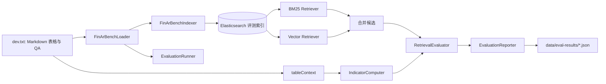

# FinAR-Bench 财务指标计算评测报告

> 评测焦点：中文 A 股年报的 **indicator（财务指标计算）** 任务。
>
> 本文的最终指标结果来自 `docs/finarbench-evaluation-report.md`；代码、数据与执行框架见 `src/main/java/com/yizhaoqi/smartpai/eval/`、`data/FinAR-Bench/` 和 `data/eval-results/`。评测结论不外推为全部 RAG 链路的总准确率。

## 1. 目的、范围与边界

FinAR-Bench 用于检查 PaiSmart 对中文上市公司年报的表格事实理解、指标计算和定性推理的适配程度。本轮实际优化与量化重点是 60 道 indicator 题及其 630 个指标子项：系统从财务报表中定位原始字段，并计算比例、增长率、周转率与周转天数等结果。

当前评测并非“原始 PDF 上传到最终回答”的完整端到端 PDF 得分。`FinArBenchLoader` 从 `data/FinAR-Bench/dev.txt` 读取每家公司的 Markdown 财务报表，`EvaluationCase.tableContext` 直接供 `IndicatorComputer` 解析；`FinArBenchIndexer` 会把表格行生成 ES 评测 chunk 来测检索。因而，本结果主要证明 Markdown 财务表格条件下的检索/计算适配能力，PDF 布局解析仍应独立量化。

reasoning 类型 10 题在 `RetrievalEvaluator` 中直接标记为 `skipped`，既不能视为成功，也不应计入失败。本报告不将 FinQA、TAT-QA 写为已跑分评测，它们仅有数据调研和后续接入规划。

## 2. 数据集介绍

### 2.1 本地数据构成

| 项目 | 内容 |
|---|---|
| 路径 | `data/FinAR-Bench/dev.txt` |
| 格式 | JSONL，10 行，每行对应一家公司的完整 Markdown 财务报表及 13 个问答实例 |
| 问题总数 | 130：fact 60、indicator 60、reasoning 10 |
| 报表内容 | 利润表、资产负债表、现金流量表；主要为 2022 与 2023 两年度列，原始金额单位为元 |
| PDF 素材 | `pdf_data/pdf_data/*.pdf` 共 102 份 A 股年报；当前 `dev.txt` 实际使用其中 10 家公司 |

10 家样本公司为：600225.SH（*ST 松江）、600569.SH（安阳钢铁）、600626.SH（申达股份）、600933.SH（爱柯迪）、603201.SH（正强股份）、603228.SH（景旺电子）、603313.SH（梦百合）、603316.SH（诚邦股份）、603421.SH（鼎信通讯）、603707.SH（健友股份）。

每个实例包含 `task_id`、中文 `task`、Markdown 格式的 `ground_truth`、`task_type`、公司名和证券代码。指标题可能一次要求多个指标，因此“60 道题”和“630 个指标子项”是不同分母。

### 2.2 其他数据集的定位

`data/FinQA-main/` 和 `data/TAT-QA-master/` 已被记录在 `docs/datasets-reference.md`。前者用于研究多步数值推理的适配方法，后者用于混合表格/文本检索方法；仓库没有证据表明这两个数据集已经形成可报告的实际评测分数。

## 3. 评测系统与流程

`FinArBenchEvalService` 编排加载、索引、评测、JSON 导出和可选清理。评测默认路径为 `data/FinAR-Bench/dev.txt`，结果输出为 `data/eval-results/finarbench-eval-*.json`。运行依赖可访问 Elasticsearch、Embedding 服务和配置中的相关密钥；缺失 ES 会使依赖 Spring 上下文的 `FinArBenchRetrievalEvaluationTest` 无法启动。

### 3.1 评分口径

| 任务 | 当前评测方式 | 通过含义 |
|---|---|---|
| fact | 在候选内容中同时检验指标名与 GT 数值是否出现 | case 的全部预期事实均被找到 |
| indicator | `IndicatorComputer` 计算后，按归一化指标名与数值比较 | case 内每个子指标均在 1% 相对误差内匹配 |
| reasoning | 直接跳过 | 不纳入成功/失败结论 |

`MetricDictionary.normalize()` 用于避免“应收帐款/应收账款”等名称变体，以及“应收账款周转率”错误匹配“应收账款周转天数”。数值比较由 `RetrievalEvaluator.valuesClose()` 实现：非零数值的相对误差不超过 1%，零值使用绝对接近判断。

`Recall@5`、`Recall@10` 表示 GT 事实在前 5/10 个候选中的覆盖比例；`MRR` 是首个命中候选名次的倒数。它们衡量检索排序质量，不等价于生成答案正确率。indicator 的“子指标匹配率”是 630 个原子指标的正确比例；“case 通过率”要求一题内所有指标均正确，故通常更低。

## 4. 基线与优化方案

| 维度 | 原始方案 | 优化方案 |
|---|---|---|
| 数据读取 | 从检索候选表格文本中由 LLM 识别字段 | 直接解析 `tableContext` 中的 Markdown 表格为指标—年度—数值 Map |
| 计算 | LLM 提取、选公式、浮点/文本推算 | `BigDecimal` 按预定义公式确定性计算 |
| 公式口径 | 依赖模型隐式理解 | 显式编码平均存量、360 天、归母/总权益等规则 |
| 失败处理 | 可能遗漏字段或输出格式异常 | 无法解析/字段不足时才调用 LLM 兜底 |
| 可审计性 | 依赖提示词和模型输出 | 可追踪指标、输入字段、公式类型和数值路径 |
| 成本与稳定性 | 每题需要模型调用，结果不稳定 | 成功路径是内存计算，零模型调用费用且可复现 |

评测实现位于 `eval/IndicatorComputer.java`。它的 `parseTableToFacts()` 解析表格，`findIndicatorNames()` 以最长名称优先识别目标指标，`computeDeterministic()` 按公式类型分派，`getFact()` 执行字段匹配，`computeWithLlm()` 提供兜底。

## 5. 公式对齐与 Bad Case 闭环

对 630 个指标子项逐项分析后，发现主要错误不是“不会四则运算”，而是财务口径隐含规则与 GT 不一致。以下修复均来自 `docs/finarbench-evaluation-report.md` 的最终专项复盘。

| 修复类别 | 原问题 | 对齐后规则 |
|---|---|---|
| 存量/流量比率 | ROA、ROE、周转率直接使用期末存量 | 分母使用当年和上年平均存量（`AVG_RATIO`） |
| 周转天数周期 | 使用 365 天 | 按 GT 使用 360 天 |
| 周转天数存量 | 使用期末应收/应付/存货 | 使用平均存量（`AVG_TURNOVER_DAYS`） |
| 增长率 | 分母取上年值绝对值 | 使用带符号的上年值：`(cur-prev)/prev` |
| ROE 口径 | 合并净利润/总权益 | 归母净利润/平均归母权益 |
| 速动比率 | 只从流动资产扣存货 | 还扣预付款项、一年内到期非流动资产、其他流动资产 |
| 权益乘数 | 分母使用归母权益 | 分母使用总权益；产权比率仍是另一口径 |

字段名称还存在大量现实变体。`getFact()` 的三级匹配依次为：精确匹配并沿别名链查找、双向包含匹配、去除“合计/净额/净值/总额”后缀后匹配。这使“固定资产净额—固定资产”“非流动资产合计—非流动资产”以及“帐/账”差异不致直接造成计算失败。

## 6. 最终结果

### 6.1 指标计算专项对比

| 指标 | 纯 LLM 基线 | 确定性计算优先 | 变化 |
|---|---:|---:|---:|
| 子指标匹配率 | 396 / 630 = 62.9% | **601 / 630 = 95.4%** | **+32.5 个百分点** |
| indicator case 通过率 | 10 / 60 = 16.7% | **42 / 60 = 70.0%** | **+53.3 个百分点** |

上述数字只覆盖 60 道 indicator 题及其 630 个子指标。它们不能被解释为：

- 130 道 FinAR-Bench 题目的全任务端到端准确率；
- 原始 PDF 解析、表格检测、事实抽取和生成回答的总准确率；
- reasoning 任务的能力分数。

历史 JSON 结果中可见不同优化阶段的 fact/indicator 检索运行记录，因配置、模型调用和计算实现不同，不能与上表的最终确定性计算专项结果混合成单一总体指标。

### 6.2 修复贡献的性质

存量均值分母约影响 80 个子项，360 天约影响 68 个，增长率符号约影响 20 个；ROE、速动比率、权益乘数及字段别名处理覆盖了余下的重要口径和匹配差异。这里的“约”是错误归因估计，不应理解为互斥的精确加和，因为同一题可能同时受多个规则影响。

## 7. 剩余 29 个 gap 与边界

| 类别 | 约计数量 | 现象与可能原因 |
|---|---:|---|
| 期间费用率 | 12 | GT 在不同公司可能纳入研发、减值等不同费用项，单一公式无法完全覆盖。 |
| 应付账款周转天数 | 8 | 部分是小幅偏差；报告记录 603707.SH 存在 GT 数值疑似异常的个例。 |
| 应付账款周转率 | 4 | 与上述公司/口径差异相关。 |
| 必要数据缺失 | 5 | 源 Markdown 表中缺少存货、销售费用等计算输入。 |

这些 gap 表示在当前数据与公式约定下仍无法完全对齐。它们可能来自 GT 口径差异、GT 标注异常或源表缺字段；没有逐条外部复核前，不能绝对断言全部属于数据集错误。

## 8. 结果解读、有效性与局限

确定性路径的增益来自把“数值提取—公式选择—计算”拆为可验证的规则：一旦指标和字段定位成功，`BigDecimal` 运算不会出现模型算错、格式漂移或随机性。但这不替代检索、PDF 解析和定性推理：若输入表格结构错误、字段缺失、公司/年份过滤错误，确定性计算同样只能返回不足或错误结果。

本评测的内部有效性较强：同一份 10 公司、两年度 Markdown 表格与 GT 可重复计算；外部有效性有限：样本仅 10 份报表、任务集中在两年和已定义指标，且未把 PDF 解析噪声纳入最终数值。下一阶段应分别量化：

1. PDF → 页面/表格/单元格的解析与跨页合并质量；
2. `FinancialFact` 抽取、单位/范围和年度识别准确性；
3. 三路检索的 Recall@K/MRR 和引用正确性；
4. reasoning 的条件判断与解释质量；
5. FinQA/TAT-QA 的受控适配实验。

### 8.1 外部数据集后续适配摘要

| 数据集 | 本地规模与特征 | 对项目的用途 | 当前状态 |
|---|---|---|---|
| FinAR-Bench | 中文 A 股年报；10 份 dev 文档、130 题；另有 102 份 PDF | 中文表格事实、指标计算及 PDF 解析专项 | 已完成数据探查和 indicator 专项评测。 |
| FinQA | 英文 S&P 500 10-K/10-Q；训练/验证/公开测试共 8,281 题 | 对照多步数值推理、公式程序和单位处理 | 已调研；计划选取不超过 50 个低步数样本做受控适配，未跑分。 |
| TAT-QA | 英文表格+文本财报；2,757 文档、16,552 题 | 验证文本/表格混合证据检索与 Recall@K、MRR | 已调研；计划对文本证据及少量人工翻译表格题做分层测试，未跑分。 |

三个数据集的结果应始终分开报告：FinAR-Bench 直接匹配中文年报场景；FinQA 和 TAT-QA 只能用于验证可迁移的方法论，不能与中文场景结果合并为一个总体分数。数据许可也应在任何外部公开发布前逐项确认。

## 9. 复现指南

1. 准备 Java 17、Maven、MySQL、Redis、Kafka、MinIO 与 Elasticsearch 8.10；可参考 `docs/docker-compose.yaml` 和 `application.yml`。
2. 在仓库根目录配置 `.env` 或等价环境变量，包括数据库、MinIO、ES、JWT、DeepSeek 和 Embedding 服务所需凭据；不要把真实密钥提交到仓库。
3. 确认 `data/FinAR-Bench/dev.txt` 和对应 PDF/文本数据可读，并让 Elasticsearch 可访问。评测索引由 `FinArBenchIndexer` 创建。
4. 常规回归可执行：`mvn test`。含 ES 的 `FinArBenchRetrievalEvaluationTest` 需要 ES 服务在线；否则会因连接拒绝失败。
5. 通过使用 `FinArBenchEvalService.evaluate(dataPath, topK, cleanup)` 的应用/测试入口执行评测。该服务会加载、索引、运行 `EvaluationRunner`，并由 `EvaluationReporter` 输出 JSON。
6. 在 `data/eval-results/` 查找新生成的 `finarbench-eval-*.json`。如 `cleanup=true`，运行结束会清理 ES 中的评测数据；不要在与其他索引共用的环境中未经确认执行清理。

## 10. 附录

### 10.1 关键代码职责

| 文件 | 职责 |
|---|---|
| `eval/FinArBenchLoader.java` | 解析 JSONL、GT 和评测用例。 |
| `eval/FinArBenchIndexer.java` | 将 Markdown 表格拆为带元数据的 ES 评测 chunk。 |
| `eval/EvaluationRunner.java` | 执行 BM25/Vector 召回、合并候选并生成报告。 |
| `eval/RetrievalEvaluator.java` | fact/indicator 对比、容差与任务跳过逻辑。 |
| `eval/IndicatorComputer.java` | 表格事实解析、公式计算与 LLM 兜底。 |
| `eval/EvaluationReporter.java` | 控制台与 JSON 报告输出。 |
| `service/FinancialCalculator.java` | 生产事实库上的确定性计算及计算轨迹。 |

### 10.2 公式模式

| 公式类型 | 表达的计算模式 |
|---|---|
| `RATIO` | A / B |
| `AVG_RATIO` | A / avg(B) |
| `GROWTH` | (cur - prev) / prev |
| `TURNOVER_DAYS` | 360 × A / B |
| `AVG_TURNOVER_DAYS` | 360 × avg(A) / B |
| `QUICK_RATIO` | 严格速动资产 / 流动负债 |
| `GROSS_MARGIN` | (营收 - 成本) / 营收 |
| `PERIOD_EXPENSE` | 费用项合计 / 营收 |
| `OPERATING_CYCLE` | 存货周转天数 + 应收周转天数 |

### 10.3 文档与代码状态核验

| 已确认事实 | 待确认事实 | 仅为规划 |
|---|---|---|
| FinAR-Bench dev 为 10 公司、130 题；indicator 为 60 题、630 子项。 | 每次 JSON 运行对应的完整配置、模型与服务环境。 | FinQA/TAT-QA 实际跑分与对标结论。 |
| 指标专项从 396/630、10/60 提升到 601/630、42/60。 | PDF 端到端解析对最终指标得分的独立贡献。 | reasoning 自动评分与后续优化。 |
| 当前评测代码、报告和数据存在于工作区；部分金融增强未提交。 | 未提交变更的最终发布版本与部署状态。 | 自建大规模 Golden Set 与生产性能指标。 |
