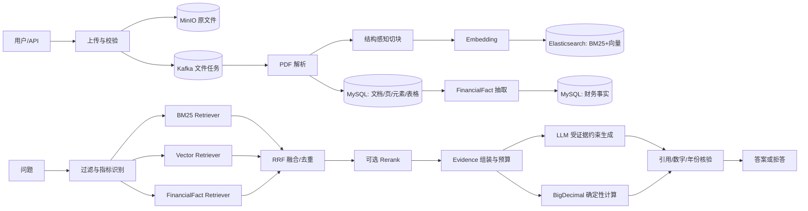

# PaiSmart：上市公司年报财务核验 RAG 项目技术总结

> 文档状态：基于当前工作区代码、`docs/`、`data/`、Maven 配置和测试报告整理。本文的“已实现”包含尚未提交的工作区变更，不等同于最新 Git commit（`0da03df`）。
>
> 证据范围：代码路径均相对仓库根目录；评测结论以 `docs/finarbench-evaluation-report.md` 为准。路线图中的目标仅作为后续规划。

## 1. 项目摘要

PaiSmart 是一个以 Java/Spring Boot 实现的企业级知识库系统。本次二次开发将其聚焦为“上市公司年报财务核验 RAG”：面向投研、尽调、财务分析及审计辅助等场景，用户上传上市公司年报 PDF 后，可检索年报证据、追溯表格原始数值，并对财务指标执行可审计的确定性计算。

项目的核心取舍是：RAG 负责**定位、组织和解释证据**；涉及金额、期间、比率和周转天数的结果由结构化事实与 `BigDecimal` 计算器优先产出，LLM 只在确定性路径无法覆盖时兜底。这样避免将精确算术完全交给生成模型。

| 状态 | 内容 |
|---|---|
| 已完成 | 上传、对象存储、Kafka 异步处理、PDF 布局解析、页/元素/表格建模、结构感知切块、向量索引、混合检索、证据引用、财务事实抽取、确定性计算与 FinAR-Bench indicator 专项评测。 |
| 已评测或受环境限制 | FinAR-Bench 的指标计算有完整专项结果；reasoning 尚未自动判分。全量 `mvn test` 时，依赖 Elasticsearch 的评测集成测试因本机 ES 未启动而失败，其余已执行测试通过。 |
| 后续规划 | 自建 Golden Set 扩展、reasoning 自动评测、FinQA/TAT-QA 适配、完整 CI/性能基准，以及更完整的 PDF 端到端专项量化。 |

### 为什么选择 A 股年报核验

年报具有长文档、跨页表格、同名科目口径差异、年度比较和高精度数值计算等特征，是通用文本 RAG 容易失真的场景。该场景既要求“找得到”，也要求“算得对、能解释、可回溯”；因此适合验证从解析、检索到计算与核验的完整能力。

## 2. 范围与边界

已覆盖的主流程是：PDF 上传与存储 → 异步解析 → 页面/元素/表格持久化 → 结构化切块和向量化 → Elasticsearch 检索 → 证据约束回答；金融路径进一步将表格单元格转化为 `FinancialFact`，支持指标计算、数值/年份/引用核验。

不应将以下能力表述为已完成：

- FinAR-Bench 的 reasoning（10 题）当前被评测器标记为 `skipped`，未自动评价；
- FinQA、TAT-QA 已完成数据探查及接入方案设计，未形成实际跑分；
- 没有仓库证据表明已经完成生产压测、CI 门禁或线上 SLA 验证；
- FinAR-Bench 指标专项当前直接利用数据集 `dev.txt` 中的 Markdown 表格 `tableContext`。它验证检索/表格解析后的计算能力，不等同于原始 PDF 解析端到端分数。

## 3. 技术栈与运行依赖

| 类别 | 技术/版本 | 在项目中的职责 | 证据 |
|---|---|---|---|
| 后端 | Java 17、Spring Boot 3.4.2、Maven | API、事务、依赖管理和应用运行 | `pom.xml` |
| 关系数据 | MySQL 8、Spring Data JPA、Flyway | 文档版本、页面、表格、财务事实、用户及权限数据 | `src/main/resources/db/migration/` |
| 检索 | Elasticsearch 8.10.0 | BM25、向量 KNN、元数据/ACL 过滤、版本化 chunk 索引 | `application.yml`、`es-mappings/` |
| 消息与缓存 | Kafka 3.2.1、Redis | 文件异步处理、重试/DLT 配置、缓存和组织标签读取 | `KafkaConfig.java`、`application.yml` |
| 对象存储 | MinIO 8.5.12 | 原始上传文件和解析产物 | `MinioParseArtifactStorage.java` |
| 文档解析 | PDFBox 3.0.3、Apache Tika 2.9.1 | PDF 布局/坐标、文本与文件类型处理 | `PdfLayoutParser.java`、`ParseService.java` |
| AI 服务 | DeepSeek Chat；DashScope `text-embedding-v4`（2048 维） | 最终回答与文本嵌入 | `DeepSeekClient.java`、`EmbeddingClient.java`、`application.yml` |
| 安全与通信 | Spring Security、JWT、WebSocket、WebFlux | 身份验证、访问控制、实时交互、外部 API 客户端 | `SecurityConfig.java`、`JwtAuthenticationFilter.java` |

## 4. 项目结构

```text
src/main/java/com/yizhaoqi/smartpai/
├── parser/       PDF 解析 SPI、页面/元素/表格中间模型
├── chunk/        token 与结构感知切块、父子与相邻关系
├── index/        索引文档映射、Embedding 元数据、ES 写入
├── retrieval/    BM25、Vector、FinancialFact 召回、RRF 与 ACL 过滤
├── rerank/       API Reranker、Noop 降级、熔断路由
├── rag/          Evidence、上下文预算、引用验证与回答状态
├── finance/      公式、精度、计算结果、计算轨迹和核验模型
├── eval/         FinAR-Bench 加载、索引、运行、结果报告
├── service/      编排上传、解析、索引、检索、事实抽取和回答
├── model/        JPA 领域实体与 DTO
├── repository/   MySQL 数据访问
├── controller/   REST 接口
└── config/       存储、检索、解析、安全和 AI 配置

src/main/resources/
├── db/migration/       V1–V8 的数据库演进
├── es-mappings/        `knowledge_base` 与 `rag_document_chunks_v1` mapping
└── application*.yml    本地、开发及 Docker 配置

src/test/java/          解析、切块、检索、核验、计算、版本化服务等测试
data/                   FinAR-Bench、其他已调研数据集及评测结果
docs/                   设计、路线图、数据集与评测报告
```

## 5. 端到端架构与数据流



MySQL 保存有事务与审计价值的领域实体；ES 服务于高效全文和向量检索；MinIO 存放大文件与解析工件；Kafka 将上传与耗时处理解耦；Redis 支撑缓存。`application.yml` 的默认检索配置启用 BM25、Vector 和 Fact 三路召回，Rerank 默认关闭。

## 6. 年报 PDF 场景专项设计

### 6.1 布局、表格与页面保真

`parser/impl/PdfLayoutParser.java` 基于 PDFBox 获取每页文本位置，形成带页码和 bounding box 的 `ParsedElement`。它按行间距构造段落、识别短标题、发现疑似表格行并拆分单元格，同时提取表格标题和单位。`DocumentParserProperties` 中配置了解析版本和 OCR 文本阈值；解析 SPI、解析工件存储和 `CrossPageTableMerger` 则用于扩展不同解析器及跨页表格处理。

持久化模型由 `DocumentVersion`、`DocumentPage`、`DocumentElement`、`TableModel`、`TableCell` 组成。这样后续回答可关联页、块、表格乃至来源单元格，而不是只保留一段扁平文本。

### 6.2 结构感知切块

`StructureAwareChunker` 接收排序后的元素，在标题、段落、表格和页面边界上组织 chunk，而不是固定字符截断。配置默认包括最小 350、最大 600 token、80 token overlap；过大元素可拆分，表格独立成块。输出包含父块、子块与相邻块关系，便于小块召回和父块回填。`ChunkingPolicy`、`ChunkDraft` 与 `ChunkRelationDraft` 使该过程可测试、可持久化。

### 6.3 年报元数据、版本与增量

`ReportMetadataExtractor`、公司标识解析器与 `FinancialReportMetadata` 记录公司、证券代码、财政年度及报告范围；人工复核接口处理仅凭文件名无法可靠推断的情况。文档版本、chunk hash、版本化索引配置和 ES 索引初始化器用于减少重建范围，并通过版本索引/别名设计支持演进。该设计已经在代码和迁移中存在；其生产规模收益尚未压测量化。

### 6.4 财务事实与权限边界

`FactExtractor` 从表格标题行、行标签及单元格读取年度和数值，通过 `MetricDictionary` 和 `UnitNormalizer` 归一化后生成 `FinancialFact`。事实携带版本、期间、范围、置信度与来源单元格，供精确检索和计算使用。系统还使用组织标签、公开/私有文档、JWT 和 ES ACL filter 限制数据可见性；`ElasticsearchAclFilterTest` 覆盖了过滤逻辑。

## 7. 检索、证据与生成

`HybridSearchService` 并发调用 `Bm25Retriever`、`VectorRetriever` 和 `FinancialFactRetriever`，从问题中提取公司代码、年份和指标等 `QueryFilter`，并由 `RrfFusionStrategy` 融合候选、`CandidateDeduplicator` 去重。检索路由有超时和降级信息；Rerank 由 `RerankerRouter` 统一管理，支持 API 模式、Noop 回退和熔断配置。

`EvidenceAssembler` 按 token 预算冻结证据集（默认 3200 token），`CitationVerifier` 检查回答所用引用是否来自本轮证据；信息不足时，回答协议要求明确拒答而非编造。`RagAnswerService` 将检索、证据、DeepSeek 生成与财务核验串联。LLM 适合说明、归纳和未覆盖问题的兜底，不是精确数值计算的唯一真相源。

## 8. 财务指标确定性计算引擎

### 8.1 分层计算路径

生产路径将已抽取的 `FinancialFact` 存在 MySQL 中，再由 `FinancialFactRetriever` 和 `FinancialCalculator` 计算；评测路径的 FinAR-Bench 原始输入是 Markdown 表格，`IndicatorComputer` 先把 `tableContext` 解析为事实 Map，再执行确定性计算，失败才调用 LLM。二者都遵循“结构化事实优先、生成模型兜底”，但数据承载形态不同，这是当前需要保留的架构边界。

### 8.2 组成与可审计性

| 组件 | 职责 |
|---|---|
| `FormulaRegistry` | 注册指标编码、表达式、单位和版本。 |
| `FinancialCalculator` | 读取指定版本/期间/范围的事实，处理缺失、冲突与除零后计算。 |
| `DecimalPolicy` | 统一 `BigDecimal` 运算和舍入策略。 |
| `CalculationTrace` | 记录公式版本、表达式、输入指标、事实 ID 和来源单元格。 |
| `CalculationStatus` | 区分 `CALCULATED`、`INSUFFICIENT`、`CONFLICT`、`NOT_APPLICABLE` 等结果。 |
| `FinancialAnswerVerifier` | 对生成回答检查引用伪造、已知数字不一致及年份不一致。 |

`IndicatorComputer` 使用精确匹配/别名链、包含匹配和去除“合计、净额、净值、总额”等后缀的三级策略定位原始字段，处理“帐/账”等表头变体。

### 8.3 财务口径的显式化

评测对齐形成 9 类公式模式：`RATIO`、`AVG_RATIO`、`GROWTH`、`TURNOVER_DAYS`、`AVG_TURNOVER_DAYS`、`QUICK_RATIO`、`GROSS_MARGIN`、`PERIOD_EXPENSE`、`OPERATING_CYCLE`。其中关键规则包括：存量/流量类指标用期初期末均值；周转天数使用 360 天；ROE 用归母净利润和归母权益；权益乘数用总权益；速动比率额外扣除预付款、到期非流动资产及其他流动资产；增长率以带符号的上年值为分母。规则来源及效果见专项评测报告。

确定性路径不会静默猜测：缺少事实、同一口径出现冲突事实、分母为零或公式未实现时返回相应状态。这个失败显式化机制比“生成一个看似合理的数字”更符合财务核验场景。

## 9. 数据、索引与安全

| 层 | 保存内容 | 原因 |
|---|---|---|
| MySQL | 文档/版本、页/元素、表/单元格、元数据、指标字典、事实、审计信息 | 事务、一致性、关系关联、精确计算与可追溯。 |
| Elasticsearch | chunk 内容、向量、元数据和权限过滤字段 | BM25、KNN 和混合召回。默认向量维度 2048。 |
| MinIO | 上传 PDF 与解析产物 | 降低数据库大对象负担。 |
| Redis | Token/组织标签等缓存 | 缩短热点读取路径。 |

安全层采用 Spring Security + JWT，用户角色及组织标签构成访问范围，公开/私有文档在查询和 ES 过滤侧共同约束。数据库、MinIO、ES 和 AI 密钥通过 `.env` 或环境变量注入，仓库配置不应包含真实密钥。

## 10. 工程质量、部署与可观测性

仓库已有解析、切块、RRF、ACL、重排降级、引用核验、财务计算、元数据提取、版本化处理和 JWT 等单元/组件测试。最近一次执行 `mvn test` 时，`FinArBenchRetrievalEvaluationTest` 在 Spring 上下文创建阶段访问 ES 被拒绝（`Connection refused`），原因是本机 Elasticsearch 未运行；该测试外其余已执行测试均通过。该结果应描述为环境依赖未满足，而不是业务逻辑回归。

`docs/docker-compose.yaml` 和 `application-*.yml` 提供依赖服务与多环境配置。Kafka 配有 all-acks、重试、幂等和 DLT topic；服务层保留日志、缓存、文件处理状态和版本处理机制。当前没有足够证据证明完整 CI 门禁、容量压测或生产 SLO 已经交付。

## 11. 关键取舍与问题闭环

| 取舍 | 选择 | 原因 |
|---|---|---|
| 通用 RAG vs 金融 RAG | 增加表格、事实、口径、计算和核验层 | 年报问题不能只依赖语义相似文本。 |
| LLM 算术 vs 确定性计算 | `BigDecimal` 优先，LLM 兜底 | 提升可复现性、审计性与成本可控性。 |
| 全文召回 vs 事实召回 | BM25/Vector/Fact 三路并行 | 同时覆盖解释性文本和精确数值。 |
| 固定分块 vs 结构切块 | 以标题/表格/页为边界 | 减少表格行列和章节语义被切断。 |
| 端到端单指标 vs 分层评测 | 检索、计算、引用分别观察 | 更容易定位 bad case，不把局部指标误称为系统总准确率。 |

## 12. 成果、局限与后续路线

| 类型 | 已有证据或建议 |
|---|---|
| 已完成 | 结构化 PDF 解析、结构切块、版本化索引、混合检索、证据协议、财务事实/计算/核验模块及 FinAR-Bench indicator 专项优化。 |
| 已量化 | indicator 子指标匹配率由 62.9% 提升到 95.4%，case 通过率由 16.7% 提升到 70.0%；详见 `finarbench-final-evaluation.md`。 |
| 局限 | indicator 成绩不是 130 题全链路成绩；reasoning 自动评测缺失；生产事实链路与 Markdown 评测路径尚有承载形态差异；尚无性能/SLA 结论。 |
| 优先后续 | 将评测表格接入统一 `FinancialFact` 链路；建立 PDF 解析、事实抽取、检索、计算的分层基准；完成 reasoning 标注与判分；再扩展 FinQA/TAT-QA。 |

### 12.1 路线图收敛

原开发计划和面试驱动路线图的独有内容已收敛如下。阶段 0–3 的多项能力已在当前代码中可见，但“阶段完成”仍应以对应验收和评测证据判断；阶段 4–6 主要是后续演进方向。

| 阶段 | 主题 | 当前定位 |
|---|---|---|
| S0 | 可复现测试、ACL、Flyway、状态机和补偿 | ACL/Flyway/测试基础已有实现；完整基线和所有补偿效果仍需量化。 |
| S1 | 年报元数据、解析 SPI、结构切块、可追溯索引、Golden Set | 前四项已有代码；自建 Golden Set 是后续任务。 |
| S2 | BM25/Vector/Fact 三路召回、RRF、Rerank、证据与评测 | 主体代码已存在；系统级消融和生成评测尚需补齐。 |
| S3 | 表格/跨页、FinancialFact、确定性计算、数字引用核验 | 主体实现已存在，FinAR-Bench 指标专项已有量化；300 题专项集未证实完成。 |
| S4 | 版本 diff、chunk hash、别名切换、删除巡检 | 版本化和 chunk hash 设计已落地；全面生命周期验收待完成。 |
| S5 | Provider 注册、路由熔断、限流缓存、可观测性、CI | 部分路由/熔断/缓存机制已有；CI 门禁与发布证据仍为后续。 |
| S6 | GraphRAG、Query Decomposition、HyDE、Agentic RAG | 研究备选，不是当前主线成果。 |

面试路线将项目亮点聚焦为三条：布局感知解析与增量生命周期、安全可评测的多阶段检索与证据生成、分阶段评测/Bad Case/多模型路由。GraphRAG 和 Agentic RAG 被明确放在非主线研究项，以避免在缺少基础评测时过早扩展复杂度。

### 12.2 部署与数据库演进摘要

原 `docker-compose.yaml` 和历史 DDL 的必要信息已收敛于此。Docker Compose 定义 MySQL、MinIO、Redis、Kafka 与 Elasticsearch 单节点服务，均使用持久卷；ES 使用 8.10.4、启用安全配置并安装 IK 分词插件，默认 JVM 内存限制为 2 GB。Kafka 配置单节点 controller/broker，并初始化文件处理和向量化主题。实际启动时仍需依据宿主机资源、端口和环境变量调整。

数据库以 Flyway 为准，迁移顺序为：V1 基线、V2 文档版本、V3 页面/元素、V4 chunk/关系、V5 表格/单元格、V6 财务指标/事实、V7 指标字典扩展、V8 FinAR-Bench 指标扩展。历史 `docs/databases/ddl.sql` 仅可作为早期结构参考，不能替代迁移脚本。

## 13. 面试/答辩表达

**30 秒介绍：** PaiSmart 将企业 RAG 定向改造成上市公司年报财务核验系统。它把 PDF 的页、表和单元格保留下来，用 BM25、向量和财务事实混合检索定位证据；对指标计算采用可追溯的 `BigDecimal` 确定性引擎，而不是让 LLM 自行心算。

**90 秒亮点：** 第一，年报不是普通长文本：项目从 PDF 布局到跨页表格、结构切块和版本化索引保留了证据位置。第二，召回分为文本、向量和事实三路，经 RRF、重排和证据预算后再生成，引用受校验。第三，针对 FinAR-Bench 发现均值分母、360 天、归母口径等隐含财务约定，建立确定性计算与字段别名匹配，把 indicator 子指标匹配率提升至 95.4%；这一数字只覆盖 630 个指标子项，不能扩大解释为全系统准确率。

**最值得展开的难点：**

1. 表格跨页、表头变体与单位归一化如何影响后续事实抽取；
2. 如何把 BM25/向量的“相关性”与财务事实的“精确性”合并；
3. 如何通过计算轨迹、数值/年份/引用校验控制财务回答幻觉。

**可能追问及诚实口径：** FinAR-Bench reasoning 尚未自动评测；当前高分是指标计算专项，不是 PDF 端到端总分；评测集成测试需要可用 Elasticsearch；FinQA/TAT-QA 尚未实际跑分。这些是下一阶段的明确验证目标，而非已完成能力。

## 14. 事实核验清单

| 已确认 | 待进一步确认/量化 | 仅规划 |
|---|---|---|
| Java/Spring、MySQL/ES/Kafka/MinIO/Redis、PDFBox、DeepSeek/DashScope 的代码与配置集成。 | 生产规模性能、完整 PDF 端到端得分、线上可靠性。 | 自建 300 题 Golden Set、FinQA/TAT-QA 全量或子集评测、GraphRAG/Agentic RAG。 |
| 解析、切块、混合检索、Rerank 降级、事实/计算/核验和相关测试。 | 当前工作区未提交改动的最终合入状态。 | 完整 CI 门禁与发布证据。 |
| FinAR-Bench indicator 62.9%→95.4%、16.7%→70.0% 专项结果。 | reasoning 的自动判分方案与结果。 | reasoning 端到端量化优化。 |
