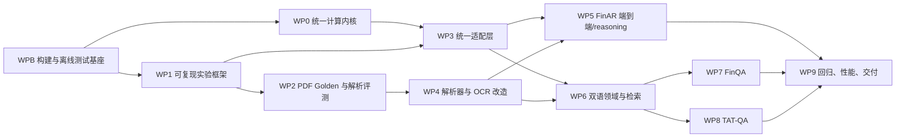

# 上市公司年报财务核验 RAG：可执行开发与评测计划

> 版本：v3.0（2026-07-30，经过架构、评测方法、交付可执行性两轮审阅）
>
> 适用仓库：`E:\autumn_recruitment\PaiSmart-main`
>
> 使用方式：本文件是面向开发 Agent 的施工规格。实施者必须按任务依赖顺序工作；每完成一个任务，运行该任务列出的测试并更新“完成记录”。计划中的目标值是验收门槛，不是当前成果。
>
> 路径约定：文中 `J:` 表示 `src/main/java/com/yizhaoqi/smartpai/`，`T:` 表示 `src/test/java/com/yizhaoqi/smartpai/`，`R:` 表示 `src/main/resources/`；其余路径均从仓库根目录起算。实施时必须展开为真实路径，不能自行更换包名。

## 0. Agent 执行约束

### 0.1 开工前必须执行

```powershell
git status --short
git log -1 --oneline
mvn -DskipTests compile
mvn test
```

当前工作区存在未提交文件。实施者不得覆盖与当前任务无关的用户改动，不得使用 `git reset --hard`。全量测试若因 Elasticsearch 未启动失败，应记录为“环境未就绪”，不能写成业务断言失败。

### 0.2 每个任务的提交边界

一个任务只允许包含：该任务列出的生产代码、迁移、配置、测试和文档。禁止在接入 FinQA/TAT-QA 时创建数据集专属数据库表或复制一套检索/计算服务。新数据格式只能通过 Adapter 转换到统一模型。

### 0.3 完成定义

任务只有同时满足以下条件才可标记完成：

1. 代码可编译；
2. 新增逻辑有单元测试；
3. 原有相关测试通过；
4. 运行输出包含数据版本、配置和样本分母；
5. 没有把跳过样本算作成功；
6. 文档中明确已知限制。

### 0.4 正式评测的可复现与安全约束

- 正式报告必须在干净工作树运行；确需使用脏工作树时，报告必须保存 `gitSha`、`dirty=true`、tracked diff 的 SHA-256、untracked 文件清单及内容哈希。
- 任何评测不得写入生产索引。评测物理索引统一命名为 `rag_eval_{dataset}_{runId}`，清理动作只能删除通过该前缀白名单且与当前 `runId` 完全一致的索引。
- API Key、Authorization header、完整提示上下文和超长年报原文不得进入日志或报告。
- 未确认许可证或数据传输边界的数据，不得发送给外部 OCR、Embedding 或 LLM 服务。
- Flyway 已执行迁移不得修改或“回滚文件”；失败后只能新增 forward-fix 迁移。

### 0.5 本版多角色审阅记录

| 轮次 | 角色 | 核心发现 | 本版处理 |
|---|---|---|---|
| 第一轮 | Java/RAG 架构 | 公式口径被 benchmark 绑架、Importer 无法满足非空/ACL、ES 回滚与事务不闭环 | profile 化公式、EVALUATION_ONLY/MATERIALIZE、双写/短事务 |
| 第一轮 | 金融评测方法 | Gold 泄漏、PDF 指标可被多输出取巧、TAT test 不兼容、FinAR 1% 容差虚高 | Input/Gold 类型隔离、P/R/F1、一对一匹配、阻断不兼容 test、四位 exact |
| 第一轮 | 技术交付 | 无真实 Maven profile/CLI/索引隔离、任务粒度过粗、无 Gate/治理 | WPB、checkpoint、run 索引、Gate、任务台账 |
| 第二轮 | 三角色交叉复核 | 构建依赖闭环、HOLDOUT 来源不明、OCR ID/状态冲突、双写缺执行者、若干 Epic 不可直接领取 | WPB 前移测试分类、WP2-0、统一 WP4 ID、DualWriteIndexWriter、Epic→叶子任务 |

## 1. 当前系统的具体缺陷

下表来自当前代码，不是推测。编号在后续任务中作为需求追踪 ID。

| 编号 | 当前缺陷 | 代码证据 | 直接影响 |
|---|---|---|---|
| D01 | 生产计算器与评测计算器口径分叉 | `FinancialCalculator`/`FormulaRegistry` 使用 365 天、增长率绝对值分母和期末存量；`IndicatorComputer` 使用 360 天、带符号分母和平均存量 | 将 FinAR 评测接入生产 `FinancialFact` 后会产生结果回退 |
| D02 | 同一指标存在两个计算内核 | `service/FinancialCalculator.java` 与 `eval/IndicatorComputer.java` 分别维护公式 | 公式修复需要同步两处，容易再次漂移 |
| D03 | PDF 表格检测是轻量启发式 | `PdfLayoutParser.splitCells()` 依赖制表符/连续空格，并按字符串位置线性估算单元格 bbox | 无法稳定处理无空格列、合并单元格、复杂表头和部分英文报表 |
| D04 | OCR 只标记、不执行 | `ParsedPage.ocrRecommended` 和 `DocumentPage.OcrStatus.PENDING` 存在，但没有 OCR Provider 调用 | 扫描件不能算已支持 |
| D05 | 标题、表名和单位规则偏中文 | `findTitle()` 只查“表/资产负债/利润/现金流”，`findUnit()` 偏“元/万元/人民币” | 英文年报表格标题和单位识别弱 |
| D06 | 跨页表合并只看相邻页、列数、标题/首行 | `CrossPageTableMerger.shouldMerge()` | 多级表头、续表标题变化可能漏合并；不同表可能误合并 |
| D07 | 解析服务把耗时解析、数据库事务和 MinIO 工件写入放在同一事务方法 | `VersionedDocumentParseService.parse()` | 长事务、外部副作用与数据库回滚难以一致 |
| D08 | 事实抽取假定第 0 行表头、首列标签，年度正则较简单 | `FactExtractor.headers()`、`YEAR=(20\\d{2})年?` | 多级表头、英文日期、季度/区间列适配不足 |
| D09 | 财务别名全局唯一且无语言/市场/准则维度 | `financial_metric_alias.uk_metric_alias`、`findByNormalizedAlias()` | 英文同词异义、跨准则口径无法安全表达 |
| D10 | 文档语言被写死为 CN | `ReportMetadataExtractor.createDocument()` 调用 `document.setLanguage("CN")`，`documentId` 以 `-CN` 结尾 | 英文文件名虽可解析，但领域元数据仍错误 |
| D11 | ES 正文只使用 IK analyzer | `rag_document_chunks_v1.json` 的 `content` 为 `ik_max_word/ik_smart` | 英文 BM25 未被正确建模；严格 mapping 无语言字段 |
| D12 | ES 使用物理索引名直接读写，没有读/写 alias | `VersionedIndexProperties.name`、`Bm25Retriever.index(name)` | v2 mapping 上线难以无停机切换和回滚 |
| D13 | 系统提示固定“仅用简体中文” | `application.yml: ai.prompt.rules` | 英文问答无法按原文语言输出 |
| D14 | token 计数是中英文字符启发式 | `CharacterTokenCounter`、`TokenBudgetPolicy` | 不同模型/语言下预算误差不可量化 |
| D15 | `EvaluationCase` 是 FinAR 专属结构 | 字段固定 `companyCode/tableContext/expectedFacts` | 无法无损承载 FinQA program 和 TAT-QA evidence mapping |
| D16 | `EvalRunReport` 不记录 Git SHA、数据切分、模型、索引和检索配置 | 当前 record 只有汇总指标和 case 列表 | 历史 JSON 难以精确复现和比较 |
| D17 | reasonings 直接跳过 | `RetrievalEvaluator` 对 `reasoning` 返回 skipped | 不能证明条件判断和解释能力 |
| D18 | 外部服务依赖与普通单测未彻底分层 | `FinArBenchRetrievalEvaluationTest` 启动完整 Spring 上下文并访问 ES | 本地 `mvn test` 容易因环境失败 |
| D19 | 评测与生产共用物理索引，清理条件也不含 runId | `FinArBenchIndexer` 使用 `VersionedIndexProperties.name`，`cleanup()` 按固定 parserVersion 删除 | 并发评测互相污染，甚至误删其他运行或生产数据 |
| D20 | 评测异常被归入 skipped | `EvaluationRunner` 捕获异常后构造 skipped 结果 | 系统错误会被隐藏，分母和成功率失真 |
| D21 | 评测入口不可恢复且用固定等待代替刷新确认 | `FinArBenchEvalService` 无 CLI/checkpoint，并使用固定 `Thread.sleep(500)` | 长任务中断后重复计费，ES 未刷新时结果不稳定 |
| D22 | 文档使用的 Maven profile 当前不存在 | `pom.xml` 有 Surefire/Failsafe，但没有 `component/integration/golden/eval-integration` profiles | 计划中的部分验收命令目前不能执行 |
| D23 | 公式注册信息与实际计算实现仍可漂移 | `FormulaRegistry` 保存表达式字符串，`FinancialCalculator` 和 `IndicatorComputer` 另写计算分支 | 即使合并类，也可能出现“展示公式”和“执行公式”不一致 |
| D24 | 文档自然键和语言语义混杂 | `Document.documentId` 注释约定语言后缀，`Document.language` 使用 `CN`；市场信息未独立建模 | 直接把 documentId 改成 marketCode 会造成兼容性和唯一性问题 |
| D25 | 现有结果只能追溯 Git SHA 的一部分状态 | `data/eval-results` 中历史报告缺少 dirty diff、数据/配置/提示词哈希 | 相同 SHA 在本地改动或模型漂移下仍无法复现 |
| D26 | 索引链路也在事务中调用外部服务 | `VersionedDocumentIndexService` 的事务覆盖 embedding 与 ES 写入 | 外部成功/DB 回滚或反向失败时状态与索引不一致 |
| D27 | 当前评测未复用生产混合检索编排 | `EvaluationRunner` 直接调用 BM25/Vector 并顺序拼接 | RRF、Fact、Rerank 消融与真实线上行为不一致 |
| D28 | 字符坐标在进入表格重建前丢失 | `PdfLayoutParser` 回调有 `TextPosition`，现有 `LayoutLine` 只保存整行 bbox | 文档要求的 x 区间聚类按当前接口无法实现 |
| D29 | 指标解析 API 无法表达冲突 | `MetricDictionary.resolve()` 返回 `Optional<FinancialMetric>` | 多语/多准则同优先级候选只能被静默选取或丢失 |
| D30 | FinAR 指标主判定使用过宽容差 | `RetrievalEvaluator.INDICATOR_TOLERANCE=0.01` | 要求四位小数的任务可能被 1% 相对误差虚高 |
| D31 | 本地 TAT-QA test 与 test_gold 版本不兼容 | 两文件为 278/1,669 与 277/1,663，实测 question/table UID 交集为 0 | 直接 zip 或 UID join 都不能产生合法 test 成绩 |

## 2. 总体技术决策

### 2.1 保留的统一领域模型

不得创建 `FinQaDocument`、`TatQaTable`、`FinArFact` 等 JPA 实体。以下模型是所有来源的统一落库目标：

```text
Document → DocumentVersion → DocumentPage → DocumentElement
                                  └──────→ TableModel → TableCell
FinancialReportMetadata → FinancialFact → FinancialMetric / FinancialMetricAlias
DocumentChunk → ChunkRelation → Elasticsearch IndexDocument
```

### 2.2 新增的两类临时模型

- `eval.adapter.model.*`：只负责把 JSON/Markdown 转成统一评测输入，不使用 JPA；
- `eval.gold.*`：只负责表达 PDF 解析 Gold，不进入生产表。

### 2.3 统一计算内核

生产和评测必须共用 `DeterministicFormulaEngine`。数据来源通过 `FactValueProvider` 注入：生产使用 JPA Provider；FinAR Markdown 使用内存 Provider。禁止在 Adapter 中计算指标。

公式定义与口径策略必须分离：

- `FormulaDefinition` 只声明指标、通用操作符、输入语义和输出单位；
- `FormulaProfile` 显式声明 360/365 天、增长率分母、期末/平均存量、权益范围、速动资产扣除项、精度和舍入；
- `FormulaProfileResolver` 只能根据调用方显式 profile 或报告的市场/准则解析，核心引擎不得根据 `datasetId` 写分支；
- 至少保留 `LEGACY_PRODUCTION_V2` 与 `FINAR_BENCH_V1` 两个 profile。未完成财务负责人审核和新旧双跑前，不切换生产默认 profile；
- 评测报告必须写出 `formulaProfileId` 和 `formulaVersion`。基准复现口径不得被包装成全球通用会计口径。

`FormulaRegistry` 不再保存一份不可执行、容易漂移的“展示字符串”。首版使用有限的 `FormulaOperator`（如 `RATIO/GROWTH/AVERAGE_STOCK_RATIO/TURNOVER_DAYS/SUM_RATIO`）加类型化 operands，由统一引擎执行；展示公式由同一 `FormulaDefinition` 渲染。

### 2.4 两种 Canonical 执行模式

FinQA/TAT-QA 的 JSON 不得伪装成真实 PDF，也不要求每次评测都污染生产数据库：

| 模式 | 用途 | 是否落生产表 | 是否证明 PDF 解析 |
|---|---|---:|---:|
| `IN_MEMORY_ORACLE` | 数据格式适配、检索/程序执行上限 | 否 | 否 |
| `MATERIALIZE` | 对身份完整的来源验证统一领域模型、切块和索引链路 | 是，写隔离运行空间 | 否 |
| `PDF_END_TO_END` | 真实上传、解析、事实、检索、计算 | 是，走生产链路 | 是 |

JSON 中没有页码或坐标时，`CanonicalEvidence` 保存原生 paragraph/table/row/cell ID；不得伪造 PDF bbox。若需要映射 `DocumentPage`，使用 `coordinateSystem=NONE` 和稳定 synthetic page，报告必须标识其来源。

### 2.5 标识符与兼容原则

- `Document.documentId` 保持逻辑文档自然键语义：`{issuerKey}-{fiscalYear}-{reportType}-{languageTag}`；`issuerKey` 内含市场命名空间，例如 `CN-SH-600000`。
- 不把 `marketCode` 单独替换为 documentId，也不原地重命名已存在的 `*-CN` 文档；旧 ID 由兼容解析器读取，新文档使用 BCP 47 语言标签。
- `Document.language` 表示逻辑文档声明语言；`DocumentVersion.detectedLanguageCode/confidence/detectorVersion` 表示该文件版本的检测结果。
- 外部数据使用 `(sourceDataset, sourceExternalId, sourceRevision)` 作为幂等键；`sourceRevision` 为原始记录规范化 JSON 的 SHA-256。现有非空 `fileMd5` 可保存兼容哈希，但不得作为 JSON 数据的唯一来源版本语义。

### 2.6 目标调用链

```text
SourceAdapter
  → CanonicalDocument/EvaluationCaseBundle(Input + isolated Gold)
  → IN_MEMORY_ORACLE，或 CanonicalImporter，或生产 PDF Parser
  → TableModel/TableCell
  → FactExtractor
  → FinancialFact
  → HybridSearchService
  → DeterministicFormulaEngine / LLM
  → LayeredEvaluationRunner
```

## 3. 实施依赖图



首个可交付闭环是 WPB→WP0/WP1→WP2/WP3→WP4→WP5；双语和剩余两个数据集不能阻塞中文 PDF 解析基线。WP9 的报告 schema、CI 和性能采集从 WP1 起持续接入，不等到最后一周。

### 3.1 阶段门

| Gate | 必须满足 | 未通过时禁止 |
|---|---|---|
| G0 构建门 | 默认 `mvn test` 完全离线；计划中所有 Maven profile 已真实存在；测试配置关闭外部 initializer | 进入任何基准评测 |
| G1 口径门 | 公式 ADR、新旧双跑差异表、财务审核签字、兼容门面测试通过 | 切换生产默认公式 profile |
| G2 数据门 | 数据许可清单、manifest/hash、Gold schema、TUNE/HOLDOUT 划分和复核完成 | 使用 holdout/test 调参 |
| G3 解析门 | PDF baseline 生成；所有失败能归到 TEXT/TABLE/FACT/OCR；分母完整 | 宣称 PDF 解析得到验证 |
| G4 评测门 | 索引隔离、checkpoint/resume、显式状态、预测工件和重复评分通过 | 跑全量或付费模型 |
| G5 发布门 | DB expand/backfill/validate/contract、ES 双写/alias 回退演练、预算和传输审查通过 | 生产发布或对外成绩 |

首次 baseline 通过后冻结 `baseline.json`。后续采用 ratchet：未经批准的核心指标下降即阻断；绝对阈值只能由 baseline 与业务容忍度共同确定，不得拍脑袋设高分。

### 3.2 WPB：构建、测试与命令基座（1–2 天）

当前 `pom.xml` 没有本文曾引用的 profiles，因此先完成以下任务：

| 任务 | 文件 | 动作 | 验收 |
|---|---|---|---|
| WPB-1 | `pom.xml`、`FinArBenchRetrievalEvaluationTest.java` | 先把现有外部测试改名 `*IT`；建立 `component/integration/golden/eval-integration` profiles；默认 Surefire 排除 `*ComponentTest/*IT/*GoldenIT`，Failsafe 只在对应 profile include；每个 Maven profile 用 `systemPropertyVariables` 设置正确的 `spring.profiles.active` | `mvn help:all-profiles` 能列出；`mvn test` 无 ES/MySQL/MinIO/Kafka/AI；打印的 active Spring profile 与 Maven profile 对应 |
| WPB-2 | `src/test/resources/application-test.yml`、新增 `application-integration-test.yml`、`application-eval-test.yml` | 显式关闭 ES initializer、Kafka consumer、MinIO、外部 AI；离线 Spring 测试加 `@ActiveProfiles("test")`，集成 profile 再按需开启 | 断开全部外部服务后 `mvn test` 通过 |
| WPB-3 | 新增 `scripts/run-evaluation.ps1` | 提供 `-Dataset -Split -InputMode -RunId -Resume -DryRun -Cleanup`，只调用稳定 Java CLI | 参数校验、dry-run、退出码单测 |
| WPB-4 | 新增 `.github/workflows/ci.yml` | 先只接 compile、unit、schema validation | 新 PR/本地等价命令有可查看结果 |
| WPB-5 | 新增 `data/dataset-manifest.json`、`R:eval-schemas/dataset-manifest.schema.json` | 盘点来源、版本、hash、许可、分发和外部传输权限；未知许可默认禁止外发 | schema 校验；FinAR/FinQA/TAT-QA 均有条目；G2 输入就绪 |

在 WPB-1 合并前，本文后续带 `-P...` 的命令属于“目标命令”，不是当前已可运行能力。

## 4. WP0：统一财务计算内核（最高优先级，3–5 天）

### 4.1 目标

修复 D01/D02，让生产和评测只维护一套公式、精度、期间和事实选择逻辑。

### 4.2 新增文件

| 文件 | 内容 |
|---|---|
| `finance/FactValue.java` | `metricCode/period/scope/value/sourceId/sourceCellId` 的不可变值对象 |
| `finance/FactValueProvider.java` | 按指标、期间和口径查询零到多条事实 |
| `finance/DeterministicFormulaEngine.java` | 不依赖 Spring/JPA 的纯计算内核 |
| `finance/FormulaDefinition.java`、`FormulaOperator.java` | 唯一可执行公式定义；展示表达式由定义渲染 |
| `finance/FormulaProfile.java`、`StockValuePolicy.java` | 周转天数、存量取值、增长率分母、权益口径、舍入等显式策略 |
| `finance/FormulaProfileResolver.java` | 按显式 profile 或市场/准则选择策略，不读取 datasetId |
| `service/JpaFactValueProvider.java` | 将 `FinancialFactRepository` 结果映射为 `FactValue` |
| `eval/MarkdownFactValueProvider.java` | 将 FinAR Markdown 表格转换为内存事实 |
| `finance/DeterministicFormulaEngineTest.java` | 参数化公式测试 |

### 4.3 接口契约

```java
public interface FactValueProvider {
    List<FactValue> find(FactQuery query);
}

public record FactQuery(
        Long versionId,
        String metricCode,
        String period,
        ReportScope scope) {}

public record FormulaProfile(
        String profileId,
        int annualDays,
        GrowthDenominatorPolicy growthDenominatorPolicy,
        StockValuePolicy stockValuePolicy,
        EquityScopePolicy equityScopePolicy,
        Set<String> quickAssetDeductions,
        MissingOpeningBalancePolicy missingOpeningBalancePolicy,
        int outputScale,
        RoundingMode roundingMode,
        String formulaVersion) {}

public final class DeterministicFormulaEngine {
    public CalculationResult calculate(
            String metricCode,
            CalculationDimensions dimensions,
            FactValueProvider facts,
            FormulaProfile profile);
}
```

`ReportScope` 移到 `finance` 领域包，JPA entity 只做映射，数据库枚举字符串保持不变；同步修改 `CalculationDimensions`、`FinancialReportMetadata`、`FinancialFact`、repository、controller 和现有测试。`FactValue` 还必须携带 `reviewStatus/confidence/sourceType`；JPA Provider 复用当前“排除 REJECTED、冲突不静默取首条”的语义。统一内核固定返回 `DECIMAL_RATIO`，输出表示不属于 profile；旧 API 若历史上返回百分数，只由 `FinancialCalculator` 兼容门面转换。

### 4.4 修改文件与具体动作

1. 新增 `docs/adr/ADR-001-formula-profile.md`（工程决策工件，不计入最终两份叙述性文档）：
   - 把当前生产行为冻结为 `LEGACY_PRODUCTION_V2`：365 天、当前实现的分母和存量口径；
   - 把 FinAR GT 复现行为定义为 `FINAR_BENCH_V1`：360 天、带符号增长分母、平均存量及数据集实际权益/速动口径；
   - 另定义 `CN_CAS_REVIEWED_V1` 占位，但在财务负责人逐项确认前不得作为默认；
   - 对每个指标列出“旧值、新 profile 值、差异原因、影响 case 数”。不得以“基准这么算”替代会计口径审核。
2. `finance/FormulaRegistry.java`
   - 版本升级，但不把所有口径硬改为 360 或某个权益口径；
   - 将 metric code 映射到 `FormulaDefinition(operator, operands, unit)`；
   - 移除手写自由文本公式，展示表达式只能由同一 definition 自动渲染；
   - 快速比率、增长率、平均存量等差异全部从 `FormulaProfile` 读取。
3. `service/FinancialCalculator.java`
   - 保留现有 public `calculate()` 作为兼容门面；
   - 删除内部公式 switch 和 `365/abs` 逻辑；
   - 构造器注入 `JpaFactValueProvider`、`DeterministicFormulaEngine` 和 `FormulaProfileResolver`；
   - 兼容门面默认使用 `LEGACY_PRODUCTION_V2`，新重载允许显式 profile；
   - 所有调用委托给统一引擎。
4. `eval/IndicatorComputer.java`
   - 保留问题指标名识别与 Markdown 解析；
   - 删除 `computeDeterministic()` 内部公式分支；
   - 将解析值映射为稳定 metric code，再调用统一引擎；
   - 已注册公式但事实不足只返回 `INSUFFICIENT`，禁止 LLM 猜值；
   - 未注册指标返回 `NOT_APPLICABLE`；LLM 最多产生“候选指标映射”，不得作为财务结果或主评分；
   - 删除 `FORMULA_LIBRARY/PROMPT_TEMPLATE` 的计算职责。若保留生成式计算实验，必须放入独立 `LLM_EXPERIMENTAL` 路线并与确定性成绩隔离。
5. 新增 `V9__align_financial_formula_inputs.sql`
   - 添加速动比率需要的原始指标和中英文别名的中文部分；
   - 不修改历史 `FinancialFact` 数值；
   - 使用 `ON DUPLICATE KEY UPDATE` 保持迁移幂等语义。
6. 新增 `FormulaDifferentialTest`：
   - 对冻结的 FinAR dev 指标同时运行 legacy 与 benchmark profile；
   - 输出逐指标差异，不以测试代码静默覆盖；
   - 财务审核完成前，只证明 profile 可复现，不改变生产默认值。

### 4.5 必测用例

`DeterministicFormulaEngineTest` 至少包含：

- 负基数增长率，分别验证 legacy 与 FinAR profile；
- 360/365 天周转天数；
- 期末/期初期末平均资产的 ROA/周转率；
- 净利润/归母净利润和总权益/归母权益组合；
- 不同 quick-asset deduction 集合；
- 同一指标多个不同值返回 `CONFLICT`；
- 缺少上期、分母为零返回 `INSUFFICIENT`；
- JPA Provider 和 Markdown Provider 对同一组事实输出完全相同。

### 4.6 验收命令

```powershell
mvn -Dtest=DeterministicFormulaEngineTest,FinancialCalculatorTest test
mvn -Dtest=FinArBenchLoaderTest test
```

完成标准：

```powershell
rg -n 'FORMULA_LIBRARY|PROMPT_TEMPLATE|case\\s+\"[A-Z_]+\"' `
  src/main/java/com/yizhaoqi/smartpai/service/FinancialCalculator.java `
  src/main/java/com/yizhaoqi/smartpai/eval/IndicatorComputer.java
```

结果不得命中第二套公式库或按 metric code 的计算 switch。`365/360/abs` 只能存在于版本化 profile/通用 operator 及其测试中。G1 未通过前，生产默认 profile 保持 legacy。

## 5. WP1：可复现实验框架（3–4 天）

### 5.1 目标

修复 D16/D18，保证每个实验可重放、外部依赖失败可区分。

### 5.2 新增文件

```text
eval/run/EvaluationRunConfig.java
eval/run/EvaluationEnvironment.java
eval/run/GitRevisionResolver.java
eval/run/EnvironmentReadinessChecker.java
eval/run/EvaluationCheckpoint.java
eval/run/EvaluationArtifactWriter.java
eval/index/EvaluationIndexNameFactory.java
eval/cli/EvaluationCommand.java
eval/model/BadCaseCategory.java
eval/model/EvaluationStatus.java
config/EvaluationProperties.java
src/test/resources/application-eval-test.yml
scripts/run-evaluation.ps1
```

`EvaluationRunConfig` 必须包含：

- 数据：datasetId、split、datasetFileSha256、sampleManifestHash、inputMode、case IDs；
- 代码/配置：gitSha、dirty/diffHash、parser/chunker/prompt/mapping hash、formulaProfileId/version；
- 检索：topK、retrieval variant、rerank、eval index name/UUID/alias target、embedding model/dimension；
- 生成：provider/model 精确版本、temperature、topP、randomSeed、tokenizerId；
- 环境：Java/Python/OS、容器镜像、startedAt；
- 预算：maxCases、maxPages、maxLlmCalls、maxEmbeddingTokens、maxOcrPages、maxEstimatedCostCny、caseTimeout、runTimeout、concurrency、retryLimit、failFastThreshold。

`--dry-run` 必须输出预计文档/页/case、调用数、费用和磁盘占用；超预算默认拒绝启动。

### 5.3 修改文件

- `eval/model/EvalRunReport.java`：增加 `EvaluationRunConfig config`、`String gitSha`、`Map<String, Long> counters`、`Map<String, Double> metrics`，保留旧字段或提供兼容构造器；
- `eval/EvaluationRunner.java`：不再在内部随机生成缺少上下文的报告；由调用方传入 config；
- `eval/EvaluationRunner.java`：任何异常不得转成 skipped；case 状态只能是 `PASSED/FAILED/SKIPPED_NO_GOLD/UNSUPPORTED/INVALID_PREDICTION/ENVIRONMENT_ERROR`；
- `eval/EvaluationReporter.java`：输出到 `data/eval-results/{dataset}/{runId}/`；先写 `.tmp`，通过 JSON schema 后原子改名；
- `eval/FinArBenchEvalService.java`：启动前调用 readiness checker；
- `eval/FinArBenchEvalService.java`：用 ES refresh API 替换固定 sleep；每 N 个 case 写 checkpoint，相同 runId 可恢复；
- 新增 `EvaluationSearchGateway`：复用生产检索编排，以 `RetrievalVariant` 控制 BM25/Vector/RRF/Fact/Rerank；评测器不得自行按 BM25 在前拼接候选；
- `pom.xml`：沿用 WPB 已建立的 profile；本工作包只新增对应集成测试，不再次修改分类规则。

### 5.4 运行隔离、恢复和工件

每次运行使用独立 `rag_eval_{dataset}_{runId}` 物理索引和专用 AccessScope，默认 `isPublic=false`。生产 read/write alias 永远不得指向 eval 索引。若需要关系库，使用独立 eval schema/Testcontainers，或所有记录带 `evaluationRunId`；首版优先内存与独立 ES。

`EvaluationIndexNameFactory` 固定规范：dataset 转小写，仅保留 `[a-z0-9_-]`，连续非法字符折叠为 `-`；runId 为 12 位小写 hex/UUID 前 12 位；总长不超过 120，超长 dataset 截断并追加 8 位 hash。创建时记录 ES index UUID。cleanup 只接受该工厂可逆校验通过且 UUID 与 manifest 一致的名称。

清理默认关闭，且只能在报告/schema/checksum 都成功后执行。删除前校验索引前缀、dataset、runId 和 index UUID；清理失败记 `ENVIRONMENT_ERROR`。并发测试必须证明清理运行 A 不影响运行 B。

固定运行目录：

```text
data/eval-results/{dataset}/{runId}/
├── manifest.json
├── config.json
├── checkpoint.json
├── predictions.jsonl
├── scores.json
├── bad-cases.jsonl
├── report.json
├── checksums.sha256
└── logs/summary.log
```

保存原始 prediction 使 scorer 可在不重新调用模型的情况下重算。CLI 退出码：0 成功、2 环境未就绪、3 数据错误、4 评测失败、5 部分完成。

### 5.5 Bad Case 分类

```java
PARSE_TEXT_ERROR, TABLE_DETECTION_ERROR, TABLE_STRUCTURE_ERROR,
METADATA_ERROR, FACT_MAPPING_ERROR, UNIT_ERROR, RETRIEVAL_MISS,
FILTER_ERROR, FORMULA_MISMATCH, MISSING_INPUT, GT_SUSPECTED,
GENERATION_ERROR, CITATION_ERROR, ENVIRONMENT_ERROR
```

每个 bad case 保存 `firstFailedLayer`、期望摘要、实际摘要、证据 ID、异常类型；禁止只保存“found x/y”。

计数恒等式必须成立：

```text
total = passed + failed + skippedNoGold + unsupported + invalidPrediction + environmentError
```

每个状态需在 metric schema 中明确是否进入具体分母，禁止再通过 `failureReason` 文本判断 skipped。

### 5.6 验收

```powershell
mvn test
mvn verify -Peval-integration
```

前者在无 ES 时必须完成；后者在依赖未就绪时应在启动阶段给出服务清单，不进入业务评分。

## 6. WP2：PDF 解析 Golden Set 与分层评测（1–1.5 周）

### 6.0 数据资格盘点（先于标注）

执行 WP2-0，输出 `data/golden/pdf-parse-v1/source-inventory.json`：逐份列出路径、SHA-256、报告类型、语言、是否完整年报、所属数据集/split、许可和可用角色。当前仓库非 FinAR-test 的 PDF 数量有限，且包含半年度报告与年报摘要，不能预设足够的独立年度报告 HOLDOUT。

若盘点后没有合格 HOLDOUT，G2 状态写 `BLOCKED_DATA`：执行 Agent 不得自行联网下载，也不得查看 FinAR test 来补齐。由项目负责人提供获准的 PDF 和许可信息后重跑 WP2-0。

### 6.1 数据布局

```text
data/golden/pdf-parse-v1/
├── manifest.json
├── schema.json
├── annotation-guide.md
├── annotations/{sampleId}.json
└── README.md
```

`manifest.json` 记录样本 ID、PDF 相对路径、SHA-256、页码、`tags[]`（DIGITAL/OCR_RECOMMENDED/CROSS_PAGE_TABLE/MULTI_HEADER/ABNORMAL_FONT）、`split=TUNE/HOLDOUT`、标注人、复核人、schema/工具版本、reviewedAt 和 disagreement。不得复制 PDF 到新目录。一个证券可能有多年度，文件名不得只用 stockCode。

至少 20% 的关键页和全部关键财务事实双人独立复标；冲突由第三方仲裁。报告 Cohen's κ/字段一致率、不可辨认/歧义数量。Gold 变更必须生成结构化 diff、重新审核并更新 manifest hash。六种现有 extractor TXT 只能用于分歧采样或预标注，不能直接当 Gold。

### 6.2 Gold Java 模型

新增：

```text
eval/gold/PdfGoldDocument.java
eval/gold/PdfGoldPage.java
eval/gold/PdfGoldTable.java
eval/gold/PdfGoldCell.java
eval/gold/PdfGoldFact.java
eval/gold/PdfGoldLoader.java
```

字段至少包括 pageNo、normalized bbox、readingOrder、tableId、row/column/span、rawText、normalizedValue、metricCode、period、unit、scope。bbox 使用 0–1 归一化坐标，避免不同 page size 直接比较 point。

### 6.3 评测器

新增：

| 文件 | 算法 |
|---|---|
| `eval/parser/PdfTextEvaluator.java` | Unicode NFKC、空白规则固定后报告 CER、字符 Precision/Recall/F1；数字 token 报告 Precision/Recall/F1，并区分符号、小数、百分号、币种和单位倍率 |
| `eval/parser/ReadingOrderEvaluator.java` | 先一对一匹配元素，再计算 Kendall τ/逆序率；unmatched 单独报告 |
| `eval/parser/TableDetectionEvaluator.java` | 同页 IoU 阈值形成候选边，再做一对一最大权匹配；报告 Precision/Recall/F1，禁止多个预测匹配同一 Gold |
| `eval/parser/TableStructureEvaluator.java` | cell detection F1、row/column adjacency F1、header classification F1、rowSpan/colSpan exact match |
| `eval/parser/FinancialFactEvaluator.java` | 先按 identity `(metricCode, period, scope, statementType, unitMultiplier)` 一对一匹配，再对 value 用 BigDecimal 绝对/相对容差联合检查；0 与缺失严格区分 |
| `eval/parser/PdfParseEvaluationRunner.java` | 读取 Gold、调用 parser、汇总分层指标和 bad case |

Fact identity 冲突、多预测和缺失分别计 FP/FN，不能静默取首条。所有 evaluator 必须把 TP/FP/FN、matched/unmatched 和分母写入 `scores.json`。阈值集中在版本化 `PdfEvaluationPolicy`，不得散落为 magic number。

### 6.4 样本选择

本地当前实测为 100 份 FinAR PDF，与 dev 10/test 90 的 `file_path` 对应；运行时仍必须 inventory 并记录 SHA-256，不能永久硬编码数量。

- FinAR dev 10 公司可作为 TUNE；
- 官方 test 90 公司在实现和阈值冻结前不得查看、挑样、做错误分析；
- v1 优先用 10 份 dev PDF，加仓库中不属于 FinAR test 的独立年报补足；
- 若必须从 test 取样，则这些公司改称“自建 parser holdout”，剩余部分只能称“自定义未污染 test 子集”，不得再称官方 test 总成绩；报告列出原始 90、剔除数、剩余分母和固定公司 ID；
- HOLDOUT 在 parser、阈值和标注规则冻结后只运行一次。

每份至少标三张主表关键页、每表至少 15 个财务事实；标签可重叠，不再用“10+5+5”暗示互斥类别。英文 PDF 必须另建独立 Gold；FinQA/TAT-QA JSON 不能证明英文 PDF 解析。

### 6.5 测试与验收

新增 `PdfGoldLoaderTest`、`PdfTextEvaluatorTest`、`TableDetectionEvaluatorTest`、`TableStructureEvaluatorTest`、`FinancialFactEvaluatorTest`，用 1–2 页人工构造 fixture 验证边界：空页、重复表、坐标缺失、括号负数、跨页表头。

首次运行只建立 baseline，不要求立即达到某个高分。退出条件是报告能把错误定位到 TEXT/TABLE/FACT/OCR，且每个指标有明确分母。baseline 冻结后，解析算法只在 TUNE 调整；HOLDOUT 结果进入最终报告，不反向调参。

## 7. WP3：统一外部数据集适配层（5–7 天）

### 7.1 新增包与模型

```text
eval/adapter/DatasetAdapter.java
eval/adapter/DatasetRegistry.java
eval/adapter/DatasetDescriptor.java
eval/adapter/DatasetSplit.java
eval/adapter/model/CanonicalDocument.java
eval/adapter/model/CanonicalSection.java
eval/adapter/model/CanonicalTable.java
eval/adapter/model/CanonicalParagraph.java
eval/adapter/model/CanonicalEvidence.java
eval/adapter/model/CanonicalEvaluationInput.java
eval/adapter/model/CanonicalGoldLabel.java
eval/adapter/model/EvaluationCaseBundle.java
eval/adapter/model/EvaluationTarget.java
eval/adapter/model/CanonicalAnswer.java
eval/adapter/finar/FinArBenchAdapter.java
```

固定契约：

```java
public interface DatasetAdapter {
    DatasetDescriptor descriptor();
    Stream<CanonicalDocument> loadDocuments(Path root, DatasetSplit split) throws IOException;
    Stream<EvaluationCaseBundle> loadCases(Path root, DatasetSplit split) throws IOException;
}

public record CanonicalEvaluationInput(
    String caseId, String datasetId, DatasetSplit split,
    String language, EvaluationTarget target, String question,
    Map<String, Object> attributes) {}
```

`EvaluationTarget` 使用 sealed interface 承载 `FactTarget/NumericTarget/ProgramTarget/ReasoningTarget/SpanTarget`，不能把参与评分的 program、scale、answerType、derivation 塞进 stringly typed attributes。`CanonicalEvidence` 明确 `PARAGRAPH/TABLE/TABLE_ROW/TABLE_CELL`、documentId、sectionId、row/column、原始 evidence key。

`EvaluationCaseBundle` 在 runner 内物理隔离 `CanonicalEvaluationInput` 与 `CanonicalGoldLabel`：Indexer、Retriever、Prompt Builder、Formula Engine 的签名中禁止出现 Gold 类型，只有预测完成后 scorer 才能获得二者。

新增 `NoGoldLeakageTest`，断言索引文档、检索请求、prompt 和运行时 input 序列化结果不含 `answer/program/steps/gold_inds/derivation/mappings/facts` 等字段。测试还要向 answer/program/derivation 注入唯一 canary，确认 index DTO、query、prompt、日志和 prediction 输入均不含 canary，防止 Adapter 把值改名塞进 attributes。FinQA 的 `tfidftopn/model_input/*_retrieved/program_re` 永久黑名单。只有真正无法统一且不参与检索/评分的字段可以放 `attributes`；核心服务不得按 `datasetId` 写 switch。

### 7.2 CanonicalImporter

新增 `service/CanonicalDocumentImporter.java`、`eval/index/EvaluationIndexBuilder.java`、`index/IndexingAccessContext.java`：

1. `EVALUATION_ONLY`：CanonicalDocument → 统一 chunk/index DTO → 当前 run 的隔离评测索引；不创建伪造的 Document/FinancialReportMetadata；
2. `MATERIALIZE`：只有具备可验证 issuer、财年、报告类型和来源时，才创建/复用 `Document/DocumentVersion`；完整交付依赖 WP4-7 的通用状态/事务重构；
3. CanonicalParagraph/Table 映射到统一 element/table/cell；`coordinateSystem=NONE` 只保存在 Canonical/import manifest，不新增 JPA 字段；确需 synthetic page 时固定 `width=1,height=1`，element bbox 为空，报告不得当成真实页坐标；
4. 有资格物化财务年报时才调用 `FactExtractor.replaceFacts(versionId)`；
5. `VersionedDocumentIndexService` 改为从 `IndexingAccessContext(ownerUserId, orgTag, isPublic)` 获取 ACL，不再强依赖 `FileUpload`；
6. 返回已定义的 `CanonicalImportResult(documentId, versionId, stage, counts, warnings)`。

Importer 使用 `ImportContext(sourceType, datasetId, externalId, sourceRevision, ownerUserId, orgTag, isPublic, importMode)`。新增迁移按 expand/backfill/validate/contract 给 `document_version` 增加来源字段；幂等键是 `(source_dataset, source_external_id, source_revision)`。重试不得重复 versionNo、page、chunk 或 ES 文档；状态为 `IMPORTING/IMPORTED/PARTIAL/FAILED`，每阶段有 checkpoint，补偿只清理本次 attempt 创建的资源。

FinQA/TAT-QA 不得填 `stockCode=UNKNOWN/fiscalYear=0` 来绕过非空字段。EVALUATION_ONLY 是默认且在 WP3 内完成；MATERIALIZE 需要身份校验和 WP4-7 通过，在此之前只可提交接口/无外部副作用的 mapper。

### 7.3 FinAR 迁移

- `FinArBenchLoader` 暂时保留，标记为兼容门面；内部委托 `FinArBenchAdapter`；
- `EvaluationCase` 不再扩字段，逐步由 `EvaluationCaseBundle` 替代；
- `FinArBenchIndexer` 改为兼容门面，EVALUATION_ONLY 委托 `EvaluationIndexBuilder`，仅 MATERIALIZE 委托 `CanonicalDocumentImporter`；不再私自构造另一种 chunk schema；
- dev/test 数量测试：dev 10 文档/130 题，test 90/1170。

### 7.4 禁止事项

- 禁止新增 `finar_*`、`finqa_*`、`tatqa_*` 数据库表；
- 禁止 Adapter 直接调用 ES；
- 禁止 Adapter 计算指标；
- 禁止测试集 Adapter 读取训练集或 gold 私有字段造成泄漏。

### 7.5 Adapter 契约测试

每个 Adapter 都必须通过：schema/count、稳定 ID、同一输入两次 hash 一致、未知字段告警、Gold 泄漏、重复文档去重和 malformed case 隔离测试。测试失败不得静默跳过整条文件。

## 8. WP4：解析器、跨页表与 OCR 改造（1.5–2 周）

### 8.1 解析策略拆分

将 `PdfLayoutParser` 拆为编排器和可替换组件：

```text
parser/pdf/PdfTextLayerExtractor.java
parser/pdf/PositionedGlyph.java
parser/pdf/PositionedToken.java
parser/pdf/LayoutLineAssembler.java
parser/pdf/TitleDetector.java
parser/pdf/TableDetector.java
parser/pdf/TableGridReconstructor.java
parser/pdf/UnitDetector.java
parser/pdf/PdfLayoutParser.java
```

不要在第一次重构同时替换全部算法。先搬移现有行为并保持 `PdfLayoutParserTest` 通过，再逐个组件改进。`PdfTextLayerExtractor` 必须把字符级坐标传成不依赖 PDFBox 的 `PositionedGlyph/PositionedToken`；当前只保留整行 bbox 的 `LayoutLine` 不足以实现列聚类。先写 character→token 坐标保持测试，再开发 grid。

### 8.2 表格列恢复

`TableGridReconstructor` 必须使用 `TextPosition` 的 x 区间聚类，而不是按字符串索引线性估算 bbox：

1. 对每行字符按 x 排序；
2. 根据字符间距与字体宽度识别 cell gap；
3. 跨行聚类 column anchors；
4. 将字符片段分配到最近列；
5. 输出 confidence 和未对齐警告；
6. 合并单元格无法可靠恢复时保守输出 span=1，并标记低置信，禁止猜测。

### 8.3 跨页表合并

修改 `CrossPageTableMerger`：

- `shouldMerge` 增加 statement type、单位、列锚点相似度、上一表是否接近页底、下一表是否接近页顶；
- 重复表头允许多行，而不是只比较 row 0；
- table-level bbox 对跨页表不做跨页坐标 union；统一规定“table bbox 只表示首页，cell bbox 才是权威值”，不返回 null；同时修改 `TableNormalizer` 的边界校验；
- 返回 `TableMergeDecision`，记录合并理由和置信度，供 bad case 报告。

### 8.4 OCR SPI

新增：

```java
parser/ocr/OcrProvider.java
parser/ocr/OcrRequest.java
parser/ocr/OcrPageResult.java
parser/ocr/NoopOcrProvider.java
parser/ocr/TesseractCliOcrProvider.java
service/OcrRoutingService.java
config/OcrProperties.java
```

```java
public interface OcrProvider {
    String name();
    Set<String> supportedLanguages();
    OcrPageResult recognize(OcrRequest request);
}
```

交付分三步：

1. `WP4-4`：SPI、路由、Noop 和 mock 测试；只能标“接口就绪”，不能关闭 D04；
2. `WP4-5`：首个可运行实现为 `TesseractCliOcrProvider`：PDFBox 300 DPI 渲染，`ProcessBuilder` 直接调用可执行文件（不得拼 shell），默认 `chi_sim+eng`，读取 TSV/hOCR bbox；配置 executable、tessdata、timeout、maxPages、maxPixels；
3. `WP4-6`：readiness checker 检查 binary 与语言包；用冻结扫描页验证 CER、Numeric F1、bbox IoU、超时/空结果降级。Docker/Windows 安装说明属于运行工件。

流程：PDF 文本层解析 → 低于阈值的页渲染图像 → OCR → 坐标归一化 → 与原文本去重/择优 → `DocumentPage.ocrStatus=SUCCEEDED/FAILED`，沿用现有枚举命名。OCR 不得在数据库事务内调用；先保存工件，再用短事务落库。凭据型远程 Provider 若后续接入，必须另审数据出境、留存、费用、限流和熔断。在 WP4-5/4-6 通过前不得宣称支持扫描件。

### 8.5 解析事务重构

`WP4-7` 修改 `VersionedDocumentParseService` 和 `VersionedDocumentIndexService`：

- 移除方法级长事务；
- 保留现有主状态枚举；新增迁移和 `DocumentVersion` 字段：非空 `processing_stage`、`attempt_id`、`last_successful_stage`、`warning_count`、`last_error_code`；同步 repository 恢复查询；
- 新增 `DocumentProcessingStateService`，用独立短事务写上述状态和实体替换；
- 外部解析、OCR、MinIO、embedding、ES 全部放在事务外；
- `processing_stage` 固定取 `PARSING/PARSE_PERSISTING/OCR/ARTIFACT_PUBLISHING/EMBEDDING/INDEXING/COMPLETED/FAILED`；warnings 写 `warning_count/manifest`，不再引入“是否扩枚举”的选择；
- 外部成功而 DB 状态写失败时能按稳定文档 ID 和 attemptId 幂等重试；
- MinIO 先写 attempt 临时 key，DB 提交后发布 manifest 指针；孤儿工件由清理任务按 attemptId 回收；
- 数据库已提交而工件失败、或 ES 成功而 DB 失败时，状态不得标记完整成功。

### 8.6 测试

新增/扩展：英文标题、`$ in millions`、无连续空格数值列、多行表头、页顶续表、页底断表、字符坐标保持、OCR 空结果、真实扫描页、OCR 坐标转换、MinIO/embedding/ES 失败补偿，以及“外部成功/DB 失败”“DB 成功/外部失败”。

## 9. WP5：FinAR 中文端到端与 reasoning（1 周）

### 9.1 三条配对基线必须分开

| inputMode | 输入 | 证明什么 |
|---|---|---|
| TABLE_ORACLE_CALC | `dev.txt.table` 直接生成内存事实 | 指标映射与公式上限 |
| MARKDOWN_RETRIEVAL | `dev.txt.table` 经 Canonical importer/chunker/retriever | 结构化入库与检索损失 |
| PDF_END_TO_END | 原始 PDF | 真实解析→事实→检索→计算能力 |

报告不得将三者平均。只有 MARKDOWN_RETRIEVAL 与 PDF_END_TO_END 在相同 case、topK、索引和公式 profile 下的配对差值，才可称为“解析+事实抽取的传播影响”；TABLE_ORACLE_CALC 与 MARKDOWN_RETRIEVAL 的差值是入库/检索损失。

### 9.2 Fact/Indicator 主评分

- Fact：按稳定 fact/evidence ID 或结构化 identity 匹配，禁止字符串 `contains`；报告 answer-level Precision/Recall/F1、数值 exact match 与整题 case exact match，多余指标行、错误年份和值均计 FP；
- Indicator：按题目要求 `HALF_UP` 量化到 4 位后 exact match，作为 passed 主判定；
- 当前 `RetrievalEvaluator.INDICATOR_TOLERANCE=0.01` 只保留为兼容诊断 `within1Percent`，不得作为准确率主指标；
- 历史 396/630、601/630 等结论必须用新 scorer 从保存的 predictions 重新计算，无法复算时明确标注旧口径；
- unsupported、missing、invalid 均保留在主分母，另报 coverage，不得通过跳过提高准确率。

### 9.3 reasoning 评测

新增 `eval/reasoning/FinArReasoningAnswerParser.java` 和 `ReasoningEvaluator.java`：

- 解析 GT 和预测中的“序号—是否成立”；
- GT 的 `0/1/None` 映射为 `FALSE/TRUE/UNDETERMINED` 三类；报告三分类 macro F1、0/1 可判定子集 accuracy、coverage、case exact match、missing/extra/invalid row；
- 综合解释没有逐句 Gold，确定性主指标只做 citation validity；supported sentence ratio 只能作为人工或固定 judge 的附加审计；
- 不用 LLM-as-judge 直接决定最终正确性；如使用，只作为附加分析并固定模型/提示词。

修改 `RetrievalEvaluator`：删除对 reasoning 的无条件 skip，路由到 `ReasoningEvaluator`；预测为空时计失败而不是 skipped，只有数据无 GT 或配置明确排除时才 skipped。

### 9.4 消融矩阵

固定同一数据与 topK，至少运行：BM25、Vector、BM25+Vector、+Fact、+Rerank、+统一计算内核。每组记录 Recall@5/10、MRR、fact 数值 EM、indicator 子项/Case、reasoning、P50/P95 延迟和降级次数。

每个指标同时报告 macro/micro、样本分母和 cluster bootstrap 95% CI；主抽样单位固定为 document/company（FinAR 同公司 13 题不能视作独立样本），case-level bootstrap 只作附加。版本/消融比较使用同 document 的 paired cluster bootstrap；FinQA/TAT-QA 也按 unique document 聚类。LLM 参与时，provider 能保证 seed 时固定 seed，否则至少重复三次，并单独报告均值、方差、调用/费用。

## 10. WP6：中英双语领域、索引与回答（1.5–2 周）

### 10.1 数据库迁移

迁移必须拆为 expand/backfill/validate/contract，版本号以实施时尚未占用的下一个 Flyway 版本为准，不得修改已执行文件：

1. expand：给 `document` 增 `declared_language_code/issuer_identifier_type/issuer_identifier/market_code`；给 `document_version` 增 `detected_language_code/confidence/detector_version`；给 report metadata 增 `accounting_standard`；给 alias 增非空且默认 `ALL` 的 language/market/standard/confidence；
2. precheck/backfill：输出非法语言、重复别名、孤儿 alias、未映射条数；复用 Java `MetricDictionary.normalize()` 的同一规则修复“帐/账”、标点和空白；
3. 补齐派生 `FinancialMetric` 后再写其 alias，禁止 alias 指向不存在的 metric；
4. validate：MySQL/H2 都运行校验 SQL；同维度同 alias 多个 metric 的冲突必须归零或进入人工冲突表；
5. contract：最后才替换唯一键为 `(normalized_alias, language_code, market_code, accounting_standard)`；维度不得 nullable，避免 MySQL 多 NULL 绕过唯一约束；`document.stock_code` 在 issuer 字段双读稳定后放宽为可空 legacy 字段，通用 ticker/CIK/LEI 统一写 `issuer_identifier`。

至少保持一版旧应用可读；迁移前记录影响行数、执行时长和备份点，失败只能新增 forward-fix。同步修改 `Document`、`DocumentVersion`、`FinancialReportMetadata`、`FinancialMetricAlias` 和 repository 查询。`MetricDictionary.resolve()` 不再返回无法表达冲突的 Optional：

```java
MetricResolution resolve(
    String sourceLabel, String language, String market, String accountingStandard);

sealed interface MetricResolution {
    record Resolved(FinancialMetric metric) implements MetricResolution {}
    record NotFound(String normalizedLabel) implements MetricResolution {}
    record Conflict(List<MetricCandidate> candidates) implements MetricResolution {}
}
```

查找顺序：精确语言+市场+准则 → 语言+ALL → 全局 ALL；多条同优先级结果必须返回冲突，不取第一条。

### 10.2 语言检测与元数据

新增 `language/LanguageDetector.java`、`HeuristicLanguageDetector.java`、`LanguageDetectionResult.java`。首版仅需可靠区分 `zh-CN/en/unknown`：按 Unicode Script 比例和英文词比例，低置信交人工复核。

修改 `ReportMetadataExtractor`：

- 不再强制 `CN`；
- documentId 保持 `{issuerKey}-{fiscalYear}-{reportType}-{languageTag}`；market 是 issuerKey 的命名空间，不能替代语言；
- 已有 `*-CN` ID 原样兼容读取，新写入使用 BCP 47；不得批量原地改主键；
- 英文公司身份不调用 CNInfo 强行解析，使用可插拔 `CompanyIdentityResolver` 路由；
- 文件名只是候选，正文/封面提取作为后续增强。

### 10.3 Elasticsearch v2

新增 `es-mappings/rag_document_chunks_v2.json`：

- `content` 固定为 `standard` analyzer 的 text，并定义 `content.zh`（IK）和 `content.en`（english）multi-fields；写入一次原文即可生成三个倒排视图；
- `content.zh` 使用 IK；
- `content.en` 使用 `english` analyzer；
- 增加 `languageCode/marketCode/accountingStandard` keyword；
- vector 维度保持配置一致。

修改 `IndexDocument`、`IndexDocumentMapper`、`ElasticsearchIndexWriter` 写入新字段。修改 `VersionedIndexProperties` 增加 `readAlias/writeAlias/mappingResource`，initializer 从资源和配置读取 mapping/vector dimension，不再硬编码 v1/2048。新增 `DualWriteIndexWriter`、`IndexBackfillCheckpoint`、`IndexWriteCompensationRepository` 和 `IndexAliasMigrationService`，顺序固定：

1. 先创建 `rag_chunks_read/rag_chunks_write` 并同时指向 v1；
2. writer 只写 write alias，retriever 只读 read alias；
3. 创建 v2，从 DB replay 全量文档；
4. 回填开始前由 `DualWriteIndexWriter` 对显式 primary/secondary 物理索引执行幂等 upsert；primary 成功、secondary 失败时记录补偿项和 watermark，该文档索引任务不标完成；
5. 校验文档数、抽样 contentHash、vector 维度、ACL、language/market/standard；
6. 用一次 `_aliases` 请求原子切换 read/write；
7. 观察期继续双写 v1/v2，重放补偿队列；回滚前验证 v1 watermark 已追平，确保切回不丢新增数据；
8. 回滚时原子切回两个 alias；失败时保持原 target。

修改 `Bm25Retriever`：按 `RetrievalContext.language` 选择 `content.zh/content.en/content`。新增 `QueryLanguageResolver`，由 `HybridSearchService` 在创建 context 时注入查询语言；不能只改 Retriever 而没有上游赋值。修改 `QueryFilter` 和 `RetrievalContext` 增加语言、市场、准则，但 ACL 逻辑保持不变。

文档声明语言、版本检测语言和 chunk 语言分开。chunk 允许 `zh-CN/en/mixed/unknown`，混合年报按 chunk 级语言选择 analyzer/filter。

查询规则固定为：`zh-CN → content.zh^2 + content`，`en → content.en^2 + content`，`mixed/unknown → content.zh + content.en + content`，使用 `bool.should` 且 `minimum_should_match=1`。测试覆盖 bulk 部分失败、补偿重放、重复 upsert、回填恢复和 read/write alias 同切同回。

### 10.4 双语提示词

修改 `AiProperties` 和 `DeepSeekClient.buildMessages()`：由 `AnswerLanguagePolicy` 生成规则。默认规则：中文问题中文回答，英文问题英文回答；引用编号 `[E#]` 不变；用户可显式请求中文解释+英文原文证据。

不得只把 `application.yml` 的中文规则翻译一遍。语言规则、证据边界和拒答规则应分别拼装并测试。

### 10.5 token 预算

保留 `CharacterTokenCounter` 作为兼容门面，新增 `HeuristicTokenCounter` 和 `TokenCounterRegistry`，按 provider/model 选择实现；暂不具备精确 tokenizer 的模型使用校准后的 heuristic，但必须记录 `tokenizerId=heuristic-{version}` 和估计误差。中文/英文分别建立至少 100 条误差样本；P95 绝对相对误差超过 15% 时，该模型在接入精确 tokenizer 前不得用于紧贴上下文上限的正式评测。

## 11. WP7：FinQA 适配与数值推理评测（5–7 天）

### 11.1 新增文件

```text
eval/adapter/finqa/FinQaAdapter.java
eval/adapter/finqa/FinQaJsonModel.java
eval/finqa/FinQaProgramParser.java
eval/finqa/FinQaProgramExecutor.java
eval/finqa/FinQaEvaluator.java
eval/finqa/FinQaOperationCoverageReporter.java
```

Adapter 的上下文映射为 `pre_text/post_text → CanonicalParagraph`、`table → CanonicalTable`。`table_ori` 只作为原始显示值，规范化表用于检索时必须保留原值引用。

必须改为 Input/Gold 分离映射：

- 允许进入模型输入：`question/pre_text/post_text/table/table_ori`；
- 只允许 scorer 读取：`answer/program/steps/gold_inds/ann_table_rows/ann_text_rows/exe_ans`；
- 永久禁止进入模型或索引：`tfidftopn/model_input/table_retrieved/text_retrieved/table_retrieved_all/text_retrieved_all/program_re`；
- 文档稳定 ID 用 `filename`，问题 ID 用数据中的 `id`。case 数与 unique document 数分别校验：train 6,251/2,110、dev 883/299、test 1,147/380、private_test 919/303。

### 11.2 执行顺序

1. 只读取 train 做操作类型统计，不跑最终指标；
2. 编码前按 operation depth、证据来源和单位分层冻结 dev 50 条固定 ID，只作为 CI smoke set，不作为 benchmark 总成绩；
3. dev 883 条用于开发；不根据运行结果重选 smoke ID；
4. 先支持无需新金融指标实体的通用算术：add/subtract/multiply/divide/exp/greater；
5. 实现、prompt、operation coverage 和阈值冻结后，test 1,147 只运行一次；private_test 没有 gold，不用于本地准确率；
6. unsupported operation 保留在主分母，并单独报告 coverage。

### 11.3 两种推理输出模式

| 模式 | 系统输出 | 可报告指标 |
|---|---|---|
| `ANSWER_ONLY` | answer、scale、citations | 自定义 `normalizedAnswerAccuracy`、evidence/引用指标；不得冠以“官方 execution accuracy” |
| `STRUCTURED_REASONING` | 受 JSON Schema 约束的 operation AST、operands、evidence IDs、answer、scale | operand recall、program exact/equivalent、execution consistency |

`normalizedAnswerAccuracy` 与 `qa.answer/qa.exe_ans` 对齐，fixture 必须覆盖百分比、舍入、负数、yes/no 和 scale。只有 STRUCTURED_REASONING 才对齐官方 program/execution accuracy。执行 Gold program 只能报告 `oracle_executor_accuracy`，不能当系统推理成绩。Gold program/steps 在 prediction 完成后才交给 scorer。

### 11.4 防止 benchmark 特化

`FinQaProgramExecutor` 是通用算术 AST 执行器，不允许按题目 ID/文件名写逻辑；Finance `FormulaRegistry` 只注册业务指标，不直接塞入 FinQA 的每条 program。

### 11.5 测试

`FinQaAdapterTest` 同时校验 case/unique document 计数、黑名单和稳定 ID；`NoGoldLeakageTest` 检查 index/prompt；`FinQaProgramParserTest` 覆盖中间变量 `#0`、百分比、负数、除零和未知操作；与本地官方 `code/evaluate/evaluate.py` 在小 fixture 上对齐答案规范化。

## 12. WP8：TAT-QA 混合证据评测（5–7 天）

### 12.1 新增文件

```text
eval/adapter/tatqa/TatQaAdapter.java
eval/adapter/tatqa/TatQaJsonModel.java
eval/tatqa/TatQaEvidenceMapper.java
eval/tatqa/TatQaAnswerNormalizer.java
eval/tatqa/TatQaEvaluator.java
```

输入映射：`paragraphs → CanonicalParagraph`、`table → CanonicalTable`、`question → CanonicalEvaluationInput`。`answer/derivation/facts/mappings/tree_derivation/rel_paragraphs/answer_from/scale/req_comparison` 全部进入 `CanonicalGoldLabel`，不得放进模型可见 attributes。

### 12.2 分层运行

- dev 278 文档/1,668 题；先校验计数；
- 按 `answer_from=text/table/table-text` 分组报告，禁止只给平均值；
- 按 `answer_type=span/multi-span/count/arithmetic` 分组报告；
- 文本 evidence 可用 `rel_paragraphs` 评 Recall@5/10、MRR；
- table/table-text 原始 dev 没有统一 cell Gold：只有存在 mappings 或人工标注时才评 cell Recall，否则只报 table source hit 与 operand recall；
- 第二阶段复用本地官方 `TaTQAEmAndF1`，普通回答模式报告 Overall EM/F1、Scale accuracy、按 answer_type/answer_from 分组、missing/invalid；
- 只有系统输出受 schema 约束的 structured derivation/AST 时才报告 arithmetic execution consistency；执行 gold derivation 只能叫 oracle executor test；
- 本地 `tatqa_dataset_test.json`（278 文档/1,669 题）与 `tatqa_dataset_test_gold.json`（277/1,663）实测共享 question/table UID 为 0，属于不兼容版本。禁止 zip 或 join 后评分；第一阶段只在 dev 开发。`test_gold` 只能作为独立有标签版本并记录文件 hash。若要官方 test，先取得 UID 对齐版本。

### 12.3 受控表格子集

编码前分层冻结 30 个 table/table-text case，保存固定 UID，人工补充 cell evidence 的 row/column、原值、标注人和版本；它只作为 CI smoke set。验证表格行列到 chunk/事实的映射，不要求把所有英文表格强制映射成财务指标；非指标型表格仍作为 `TableCell` 和证据参与检索。

新增 `TatQaDatasetCompatibilityTest`：校验文档/问题数、UID 唯一性、join coverage 和文件 hash；coverage 低于配置门槛直接失败，不进入 scorer。新增官方 scorer oracle fixture，确保 Java 预测格式与 Python 官方实现一致。

## 13. WP9：回归、性能、CI 与交付（持续）

### 13.1 测试分层

| 层 | 命名 | 命令 | 外部依赖 |
|---|---|---|---|
| 单元 | `*Test` | `mvn test` | 无 |
| 组件 | `*ComponentTest` | `mvn test -Pcomponent` | H2/本地 fixture |
| 集成 | `*IT` | `mvn verify -Pintegration` | MySQL/ES/MinIO/Kafka/AI（按任务） |
| Golden | `*GoldenIT` | `mvn verify -Pgolden` | PDF 数据与必要服务 |

### 13.2 CI 门禁

基础门禁：compile、unit、Flyway migration validation、JSON schema validation、NoGoldLeakageTest。夜间门禁：FinAR dev regression、PDF Golden TUNE、FinQA 50 smoke、TAT-QA 30 smoke。HOLDOUT/test 只在冻结里程碑运行，不作为每晚调参反馈。禁止每个 PR 运行全量外部 LLM 评测造成成本和随机失败。

每次门禁读取冻结 baseline 并使用 ratchet；若数据/schema/profile 改变造成不可比，必须创建新 baseline 系列，禁止覆盖旧文件。

### 13.3 性能基线

新增 `eval/perf/PerformanceSample.java` 和报告字段，记录 PDF 页数、文件大小、解析总耗时/每页、OCR 页数、chunk 数、embedding 批次、ES 索引耗时、检索 P50/P95、LLM/Embedding/OCR 调用数、tokens、重试和估算/实际费用。只报告固定机器和服务配置下的实测值，所有外部调用受 `EvaluationRunConfig` 预算限制。

### 13.4 最终报告

最终只维护两份面向人的中文主文档：

1. `docs/PaiSmart上市公司年报财务核验RAG项目技术总结.md`：架构、实现、公式口径、PDF/OCR、双语能力、运维与已知限制；
2. `docs/FinAR-Bench财务指标计算评测报告.md`：实施时可扩展标题和内容为综合评测报告，包含 FinAR 三层对照、PDF Golden、FinQA、TAT-QA、消融、置信区间和边界，避免复制出新的总结文档。

五类报告内容作为上述两份文档中的章节。机器可读 report/config/predictions/schema/manifest、ADR 和本开发计划属于工程工件，不算新增叙述性报告；两份主文档必须链接相应 runId 和 checksum。

### 13.5 数据治理与保留

`data/dataset-manifest.json` 由 WPB-5 在 G2 前建立，WP9 只做最终复核。每个数据集记录来源、版本、下载时间、文件 SHA-256、许可证、可否再分发、允许用途、是否可传外部服务。FinQA/TAT-QA 本地有 LICENSE；FinAR 本地未发现 LICENSE，确认前不得外发或打包分发。

临时运行默认保留 30 天；正式 baseline 保留 manifest、config、predictions、scores、摘要日志与 checksum。WP9-2 修改 `.gitignore`、新增 `data/eval-results/baseline-allowlist.txt` 与 `scripts/cleanup-eval-artifacts.ps1`；清理脚本默认 dry-run，只删除不在 allowlist 且超过保留期的 run 目录。

## 14. 推荐排期与任务颗粒度

| 周次 | 工作包 | 可独立交付结果 |
|---|---|---|
| W1 | WPB + WP0-1/0-2 + WP1-1 | 离线构建基座、公式 profile/ADR、报告 schema |
| W2 | WP0-3/0-4 + WP1-2/1-4 | 统一公式内核、隔离索引、可恢复评测 CLI |
| W3 | WP2 | PDF Golden TUNE/HOLDOUT 和解析 baseline |
| W4 | WP3-1～3-3 | Input/Gold 隔离、Canonical EVALUATION_ONLY、FinAR adapter |
| W5 | WP4-1/4-2/4-3 | 坐标保持、表格恢复、跨页表 |
| W6 | WP4-4～4-7 | 实际 OCR、扫描页验收、解析/索引短事务状态机 |
| W7 | WP3-4 + WP5 | Canonical MATERIALIZE、FinAR 三条基线、reasoning |
| W8 | WP6 | 多语领域迁移、ES 双写/alias、双语回答 |
| W9 | WP7 与 WP8（接口冻结后可并行） | FinQA/TAT-QA smoke、dev 与冻结 test 计划 |
| W10 | WP9 | 回归/性能/治理、两份主文档总交付 |

每个工作包应继续拆成 0.5–2 天的提交。若单个提交同时改数据库、ES、Parser、Retriever、评测器而无中间测试，应继续拆分。

## 15. 可直接派发的任务台账

以下叶子任务初始状态均为 `TODO`；标成 `EPIC（不可领取）` 的行只用于汇总，Agent 只能领取其子任务。一个叶子任务目标为 0.5–2 天，必须在 PR 描述中把表内验收改写成可复制的单条命令并填写实际结果；未列测试类的任务不得开工。“核心文件”是独占修改范围，共享文件需要先确认上游任务已合并。测试文件使用与生产类同包的 `T:` 路径。

| ID | 依赖 | 核心文件/目录 | 明确输出 | 验收与回滚 |
|---|---|---|---|---|
| WPB-1 | 无 | `pom.xml` | 四类测试 profile，默认离线 | `mvn help:all-profiles && mvn test`；回滚 pom 单提交 |
| WPB-2 | WPB-1 | `src/test/resources/application-*-test.yml` | 外部服务按 profile 开关 | 断开服务跑 unit；只回滚配置 |
| WPB-3 | WPB-1 | `J:eval/cli/`、`scripts/run-evaluation.ps1` | dry-run/参数/退出码入口 | CLI fixture 测试；无外部写入 |
| WPB-4 | WPB-1, WPB-2 | `.github/workflows/ci.yml` | compile/unit/schema 门禁 | CI dry run；删除工作流即回滚 |
| WPB-5 | WPB-1 | `data/dataset-manifest.json`、`R:eval-schemas/dataset-manifest.schema.json` | 数据许可/传输清单 | `DatasetManifestSchemaTest`；删除新增工件回滚 |
| WP0-1 | G0 | `docs/adr/ADR-001-formula-profile.md`、`J:finance/FormulaProfile*.java` | legacy/FinAR/待审核生产 profile | profile 序列化测试；不改生产默认 |
| WP0-2 | WP0-1 | `J:finance/FormulaDefinition.java`、`FormulaOperator.java`、`FormulaRegistry.java` | 唯一可执行定义 | registry 覆盖/重复 code 测试；保留旧 API |
| WP0-3 | WP0-2 | `J:finance/Fact*.java`、`DeterministicFormulaEngine.java`、`CalculationDimensions.java`、`J:model/FinancialReportMetadata.java`、`FinancialFact.java`、repository/controller/tests | 纯引擎、JPA provider、领域 ReportScope | `mvn -Dtest=DeterministicFormulaEngineTest,FinancialCalculatorTest test`；DB 字符串不变 |
| WP0-4 | WP0-3 | `J:service/FinancialCalculator.java`、`J:eval/IndicatorComputer.java` | 两门面委托统一引擎，移除 LLM 算值 | 新旧差异报告、兼容测试；feature flag 切 legacy |
| WP0-5 | WP0-3 | 下一可用 Flyway 迁移、metric seed | 缺失原始指标与别名 | precheck/validate、MySQL/H2；失败 forward-fix |
| WP1-1 | G0 | `J:eval/run/`、`J:eval/model/EvalRunReport.java`、`R:eval-schemas/` | config/report/status schema | round-trip/schema/counter 恒等式 |
| WP1-2 | WP1-1 | `J:eval/FinArBenchEvalService.java`、`EvaluationRunner.java`、`EvaluationSearchGateway.java` | readiness、显式状态、生产检索编排复用 | 无字符串判 skipped；异常注入测试 |
| WP1-3 | WP1-1 | `J:eval/index/`、`EvaluationIndexNameFactory.java`、`FinArBenchIndexer.java` | 规范化 runId 索引与安全 cleanup | `EvaluationIndexIsolationIT`：A/B 并发、删 A 保留 B；cleanup 默认 false |
| WP1-4 | WPB-3, WP1-2, WP1-3 | `J:eval/run/EvaluationCheckpoint.java`、`EvaluationArtifactWriter.java` | checkpoint/resume、原子报告、rescoring | 中断恢复不重复 case；`.tmp` 不被当报告 |
| WP2-0 | WPB-5 | `data/golden/pdf-parse-v1/source-inventory.json` | PDF 资格盘点或 `BLOCKED_DATA` | `PdfSourceInventoryTest`；不得自行补数据 |
| WP2-1 | WP1-1, WP2-0 | `data/golden/pdf-parse-v1/schema.json`、`annotation-guide.md`、`J:eval/gold/` | Gold schema/model/loader | `mvn -Dtest=PdfGoldLoaderTest test` |
| WP2-2 | EPIC（不可领取） | WP2-2a, WP2-2b, WP2-2c | 冻结 TUNE/HOLDOUT、复核和 IAA | 子任务全部通过才完成 |
| WP2-2a | WP2-1 | `manifest.json` | 固定 sample/page/split/hash | `PdfGoldManifestTest`；manifest 评审后冻结 |
| WP2-2b | WP2-2a | `annotations/*-tune.json` | TUNE 标注与复标 | schema 校验+字段一致率；只回滚本批 annotation |
| WP2-2c | WP2-2b | `annotations/*-holdout.json`、Gold diff | HOLDOUT 双人复核与仲裁 | `PdfGoldReviewTest`+复核签字；禁止实现者独自批准 |
| WP2-3 | WP2-1 | `J:eval/parser/*Evaluator.java` | CER、Numeric F1、一对一表/结构/Fact 指标 | 人工 fixture 的 TP/FP/FN 精确断言 |
| WP2-4 | WP2-2c, WP2-3 | `PdfParseEvaluationRunner.java`、baseline 目录 | 首份分层 baseline | G3；失败层覆盖 100%，冻结 checksum |
| WP3-1 | WP1-1 | `J:eval/adapter/model/` | typed Input/Gold/Target/Evidence | `NoGoldLeakageTest`、序列化测试 |
| WP3-2 | WP3-1, WPB-5 | `DatasetAdapter.java`、`DatasetRegistry.java`、`FinArBenchAdapter.java` | registry 与 FinAR adapter | 10/90 文档、130/1170 case、稳定 hash |
| WP3-3 | WP3-1, WP1-3 | `J:eval/index/EvaluationIndexBuilder.java`、`J:index/IndexingAccessContext.java` | EVALUATION_ONLY 链路 | 不创建伪 Document/FileUpload；ACL 隔离 |
| WP3-4 | EPIC（不可领取） | WP3-4a, WP3-4b, WP3-4c | MATERIALIZE importer | 子任务全部通过才完成 |
| WP3-4a | WP3-2, WP3-3, WP4-7 | `J:service/CanonicalDocumentImporter.java`、`CanonicalImportResult.java` | 无外部副作用 mapper 与编排 | `CanonicalDocumentImporterTest`；feature flag 关闭回滚 |
| WP3-4b | WP3-4a | 来源字段 expand/backfill/validate/contract 迁移、`DocumentVersion.java` | sourceRevision 幂等键 | `CanonicalSourceMigrationIT`；失败 forward-fix |
| WP3-4c | WP3-4b | importer checkpoint/recovery tests | retry 不重复 version/page/chunk/index | `CanonicalImportRecoveryIT`；按 attempt 补偿 |
| WP4-1 | WP2-4 | `J:parser/pdf/Positioned*.java`、`PdfTextLayerExtractor.java`、`LayoutLineAssembler.java` | 字符到 token 坐标无损传递 | 现有 parser 回归+坐标 fixture |
| WP4-2 | WP4-1 | `TableDetector.java`、`TableGridReconstructor.java` | 列锚点、置信度、warnings | 无空格/多表头 fixture 与 TUNE 提升 |
| WP4-3 | WP4-2 | `J:service/CrossPageTableMerger.java`、`TableNormalizer.java` | 可解释 merge decision、首页 bbox 规则 | 误合并/漏合并/跨页坐标测试 |
| WP4-4 | WP4-1 | `J:parser/ocr/`、`OcrRoutingService.java`、`OcrProperties.java` | SPI/Noop/Mock，仅接口就绪 | mock/路由/预算测试，不关闭 D04 |
| WP4-5 | WP4-4 | `TesseractCliOcrProvider.java`、运行配置 | chi_sim+eng Provider | `TesseractCliOcrProviderTest`：TSV/bbox/timeout；关闭开关回滚 |
| WP4-6 | WP4-5, WP2-2c | `OcrReadinessChecker.java`、扫描页 fixture、运行说明 | readiness 与真实扫描页成绩 | `TesseractCliOcrProviderIT,PdfOcrGoldenIT`；不达标关闭 OCR |
| WP4-7 | EPIC（不可领取） | WP4-7a, WP4-7b, WP4-7c, WP4-7d | 通用处理状态与短事务编排 | 子任务全部通过才完成 |
| WP4-7a | WPB-1 | 状态字段迁移、`DocumentVersion.java`、repository | stage/attempt/warning/error 持久化 | `DocumentProcessingStateMigrationIT`；forward-fix |
| WP4-7b | WP4-7a, WP4-4 | `VersionedDocumentParseService.java`、`DocumentProcessingStateService.java` | parser/OCR/MinIO 出事务 | `VersionedDocumentParseRecoveryTest`；旧入口兼容 |
| WP4-7c | WP4-7a | `VersionedDocumentIndexService.java`、state service | embedding/ES 出事务 | `VersionedDocumentIndexRecoveryTest`；稳定 ID upsert |
| WP4-7d | WP4-7b, WP4-7c | recovery/cleanup tests、artifact manifest | DB/外部双向故障补偿 | `DocumentProcessingCompensationIT`；只清当前 attempt |
| WP5-1 | EPIC（不可领取） | WP5-1a, WP5-1b, WP5-1c, WP5-1d | FinAR 三层基线 | 子任务全部通过才完成 |
| WP5-1a | WP0-4, WP3-2 | FinAR fact/indicator scorer | fact P/R/F1、四位 exact、within1Percent 诊断 | `FinArFactIndicatorScorerTest`；旧报告可 rescoring |
| WP5-1b | WP5-1a | TABLE_ORACLE_CALC runner/config | 公式上限 baseline | dev 130 prediction/scores/checksum |
| WP5-1c | WP5-1a, WP3-3 | MARKDOWN_RETRIEVAL runner/config | 入库/检索 baseline | 与 1b 同 case/config，保存差值 |
| WP5-1d | WP5-1a, WP4-3 | PDF_END_TO_END runner/config | PDF 端到端 baseline | 与 1c 配对；污染公司剔除清单 |
| WP5-2 | WP5-1a | `J:eval/reasoning/`、`RetrievalEvaluator.java` | 三分类 reasoning scorer | `FinArReasoningEvaluatorTest`：0/1/None、missing/extra/invalid |
| WP5-3 | G4, WP1-2, WP5-1b, WP5-1c, WP5-1d, WP5-2 | variant configs、reporter | 消融、cluster paired bootstrap、成本 | 同 document/config hash；95% CI |
| WP6-1 | EPIC（不可领取） | WP6-1a, WP6-1b, WP6-1c, WP6-1d | 多语 DB 演进 | 子任务全部通过才完成 |
| WP6-1a | WP3-4, WP4-7 | expand 迁移、Document/Version/Metadata/Alias entities | 新可空/默认 ALL 字段与双读 | `MultilingualExpandMigrationIT`；旧应用 smoke |
| WP6-1b | WP6-1a | backfill job、normalize 共享实现 | issuer/语言/准则/alias 回填 | `MetricAliasBackfillIT`；输出冲突/孤儿计数 |
| WP6-1c | WP6-1b | validation SQL/runner、冲突工件 | precheck 归零或人工清单 | `MultilingualMigrationValidationIT`；不改约束 |
| WP6-1d | WP6-1c | contract 迁移、旧字段兼容读取 | 非空维度、复合唯一、legacy stockCode | `MultilingualContractMigrationIT`；forward-fix |
| WP6-2 | WP6-1d | `J:language/`、`MetricDictionary.java`、metadata extractor | query/doc/version/chunk 语言与冲突返回 | zh/en/mixed/unknown、Conflict 测试 |
| WP6-3 | EPIC（不可领取） | WP6-3a, WP6-3b, WP6-3c, WP6-3d, WP6-3e | ES v2 上线与回滚 | 子任务全部通过才完成 |
| WP6-3a | WP6-1d, WP6-2 | `R:es-mappings/rag_document_chunks_v2.json`、`IndexDocument*` | multi-field 与多语 metadata | `IndexDocumentMappingV2Test`；不切 alias |
| WP6-3b | WP6-3a | `VersionedIndexProperties.java`、initializer、`IndexAliasMigrationService.java` | v1 read/write alias bootstrap | `IndexAliasBootstrapIT`；原子切回 v1 |
| WP6-3c | WP6-3b | `DualWriteIndexWriter.java`、compensation repository | v1/v2 幂等双写与补偿 | `DualWriteIndexWriterIT`；关闭 secondary 回滚 |
| WP6-3d | WP6-3c | backfill service/checkpoint/validator | 全量+增量追平、hash/ACL/维度校验 | `IndexBackfillRecoveryIT`；保留旧 alias |
| WP6-3e | WP6-3d | alias cutover/rollback command | read/write 原子同切、观察期与切回 | `IndexAliasCutoverIT`；演练记录签字 |
| WP6-4 | WP6-2, WP6-3 | `AiProperties`、`DeepSeekClient`、`AnswerLanguagePolicy`、token counter | 双语回答与 tokenizer 误差报告 | 中英/显式语言/citation/refusal 测试 |
| WP7-1 | WP3-1, WPB-5 | `J:eval/adapter/finqa/` | Input/Gold adapter、文档去重、黑名单 | case/document 计数、NoGoldLeakage |
| WP7-2 | WP7-1, WP0-3 | `J:eval/finqa/*Program*.java`、structured schema | 通用 AST parser/executor | 官方 evaluator fixture、未知 op/除零 |
| WP7-3 | EPIC（不可领取） | WP7-3a, WP7-3b, WP7-3c | FinQA 运行与报告 | 子任务全部通过才完成 |
| WP7-3a | G4, WP1-4, WP7-2, WP6-4 | smoke manifest/runner | 冻结 50 smoke 和 CI 报告 | `FinQaSmokeEvaluationIT`；不可重选 ID |
| WP7-3b | WP7-3a | dev config/reporter | 883 dev 分层结果 | ANSWER_ONLY/STRUCTURED 分开，coverage 不删 |
| WP7-3c | WP7-3b, 冻结审批 | test config/reporter | 一次性 1,147 test 结果 | manifest 锁定；失败只能恢复同 runId |
| WP8-1 | WP3-1, WPB-5 | `J:eval/adapter/tatqa/`、compatibility test | dev adapter、版本兼容门 | 278/1668；不兼容 test 直接失败 |
| WP8-2 | EPIC（不可领取） | WP8-2a, WP8-2b | 证据映射与受控 Gold | 子任务全部通过才完成 |
| WP8-2a | WP8-1, WP1-4 | text evidence mapper/scorer | rel_paragraphs Recall/MRR | `TatQaTextEvidenceEvaluatorTest` |
| WP8-2b | WP8-2a | 30 题 manifest/cell annotations | table/mixed 人工 cell Gold | schema+双人复核；每批最多 10 题 |
| WP8-3 | G4, WP8-2a, WP8-2b, WP6-4 | answer normalizer/evaluator | 官方 EM/F1/Scale 与分组报告 | Python oracle fixture 对齐 |
| WP9-1 | 各 WP 测试 | CI/baseline schema | PR/nightly/frozen milestone 门禁 | ratchet 与不可比 baseline 分支 |
| WP9-2 | WP1-4, WPB-5 | `J:eval/perf/`、`.gitignore`、baseline allowlist、`scripts/cleanup-eval-artifacts.ps1` | 性能/成本/许可证复核/保留策略 | 预算超限拒绝、secret scan、cleanup dry-run |
| WP9-3 | G5 | 两份中文主文档 | 总结与综合评测更新 | 链接 runId/checksum，事实/计划分开 |

人工标注任务按批实例化：PDF 每批最多 5 份（如 `WP2-2b-01`），TAT-QA 每批最多 10 题；每个批次有独立 annotation diff、复核人和验收记录。EPIC 和外部审批不是可提交代码任务，不能由 Agent 标记完成。

### 15.1 文件互斥与审批

- `pom.xml` 由 WPB 独占至 G0；`eval/adapter/model` 由 WP3-1 独占至接口冻结；`DocumentVersion`/迁移按 WP4-7a → WP3-4b → WP6-1 顺序修改；ES properties/writer/retrievers 由 WP1-3 完成评测隔离后再交 WP6-3b～3e。
- WP7 与 WP8 只有在 WP3-1、WP1-4 接口冻结后才可并行；不得各自修改 Canonical 核心模型。
- 公式口径实现者不能代替财务审核人批准 G1；Gold 标注人不能单独批准自己标注的 HOLDOUT；生产 alias 切换需要发布审批。
- 时间估计假设 1 名 Java/RAG 工程师、1 名兼职财务复核者、1 名兼职 Gold 复核者，且 OCR/ES/MySQL 环境可用。缺少复核人或真实 OCR 运行环境时，相关 Gate 保持未通过，不能用 Agent 自审替代。

## 16. Agent 任务完成记录模板

每完成一个任务，在 PR/提交说明中填写：

```markdown
### Task: WPx-y 名称
- 解决缺陷：Dxx, Dxx
- 新增文件：
- 修改文件：
- 数据迁移：无 / Vxx
- 行为变化：
- 兼容性：
- 测试命令与结果：
- 评测数据/分母：
- 未解决问题：
- 回滚方式：
```

## 17. 风险登记与需求追踪

### 17.1 主要风险

| 风险 | 触发信号 | 预防/处置 | Owner |
|---|---|---|---|
| 为跑分误改生产财务口径 | benchmark profile 被设成默认、旧 API 数值突变 | G1、legacy profile、差异双跑、财务审批 | 财务口径负责人 |
| Gold/测试集污染 | 实现冻结前查看 FinAR test/HOLDOUT 或重选 smoke | manifest 冻结、访问记录、受污染样本从最终分数剔除 | 评测负责人 |
| Gold 字段泄漏 | prompt/index 出现 answer/program/derivation | 类型隔离、黑名单、NoGoldLeakageTest | Adapter Owner |
| 评测误写/误删生产索引 | 索引不以 `rag_eval_` 开头或 cleanup 无 UUID | run 隔离、白名单、默认不清理、并发测试 | 平台负责人 |
| DB/ES 升级不可回退 | 直接删约束、只切 read alias、回填期丢增量 | expand/contract、双写、水位、read/write 同切与演练 | 数据/搜索负责人 |
| 扫描件能力被夸大 | 只有 Noop/mock 或无真实语言包 | WP4-5/4-6 与 G3，能力声明分级 | 解析负责人 |
| 外部模型漂移与费用失控 | 模型版本变化、重复调用、长任务中断 | 精确版本、checkpoint、预算、prediction 可重评分 | 评测负责人 |
| 数据许可/出境违规 | FinAR 许可不明仍外发 | dataset manifest；未知许可默认禁止外发 | 项目负责人 |

### 17.2 缺陷到交付的追踪矩阵

| 缺陷 | 主任务 | 核心测试/证据 | Gate |
|---|---|---|---|
| D01/D02/D23 | WP0-1～0-4 | Formula differential、provider parity、兼容 API | G1 |
| D03/D05/D06/D08 | WP2、WP4-1～4-3 | PDF Golden TEXT/TABLE/FACT、跨页 fixture | G3 |
| D04 | WP4-4/4-5 | 真实扫描页 CER/Numeric/bbox、readiness | G3 |
| D07/D26 | WP4-7a～7d | DB/外部双向故障注入 | G5 |
| D09/D10/D24 | WP6-1/6-2 | migration validation、语言/issuer/冲突测试 | G5 |
| D11/D12 | WP6-3 | 双写回填、hash/ACL、alias 切换/切回 | G5 |
| D13/D14 | WP6-4 | 双语 prompt、tokenizer 误差 | G5 |
| D15 | WP3、WP7、WP8 | typed target、NoGoldLeakage、adapter count | G2/G4 |
| D16/D18/D20/D21/D22/D25 | WPB、WP1 | offline test、schema、resume、隔离、hash | G0/G4 |
| D17 | WP5-2 | 三分类 reasoning fixture/report | G4 |
| D19 | WP1-3 | A/B 并发与安全 cleanup | G4 |
| D27 | WP1-2 | EvaluationSearchGateway 消融一致性 | G4 |
| D28 | WP4-1 | 字符/token 坐标保持 fixture | G3 |
| D29 | WP6-1b、WP6-1d、WP6-2 | MetricResolution Conflict 与迁移校验 | G5 |
| D30 | WP5-1a | 四位 exact 与历史 tolerance 重评分 | G4 |
| D31 | WP8-1 | TatQaDatasetCompatibilityTest | G2 |

## 18. 最终成功标准

- 同一组事实经 JPA 与 Markdown Provider 得到相同计算结果，公式只维护一处；
- 能量化 PDF 的文本、表格和事实质量，并定位第一个失败层；
- 新数据集只新增 Adapter、答案规范化和数据集特有 evaluator，不新增平行数据库实体；
- 文档语言、市场、会计准则参与指标解析和检索过滤；英文 BM25 不再依赖 IK-only 字段；
- FinAR、FinQA、TAT-QA 按各自切分和任务类型独立报告；
- 任意报告都能追溯 Git SHA、配置、索引、模型、数据版本和样本分母；
- 所有数字回答可追溯到证据、期间、单位、公式版本和输入事实；证据不足时明确拒答。
- 生产公式、FinAR 复现公式和跨市场公式通过 profile 显式区分，任何 benchmark 适配都没有按 datasetId 渗入核心业务；
- 评测 input 与 gold 在类型、序列化、索引和 prompt 层均隔离，保存 prediction 后可离线重复评分；
- 扫描件只有在真实 OCR Provider 与冻结扫描页验收通过后才标“支持”；否则能力表必须写“仅检测/接口就绪”；
- 英文 JSON 评测通过只能证明英文结构化数据链路。只有独立英文年报 PDF Gold 的 TEXT/TABLE/FACT 指标通过后，才可宣称英文 PDF 解析支持；
- DB 与 ES 都完成实际回退演练；正式评测不读写生产索引，不因 skipped/unsupported/环境异常缩小主分母。
